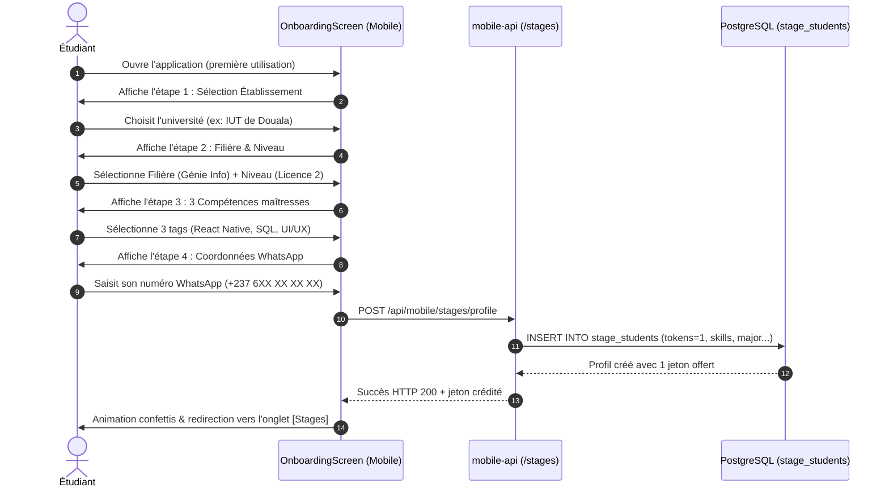
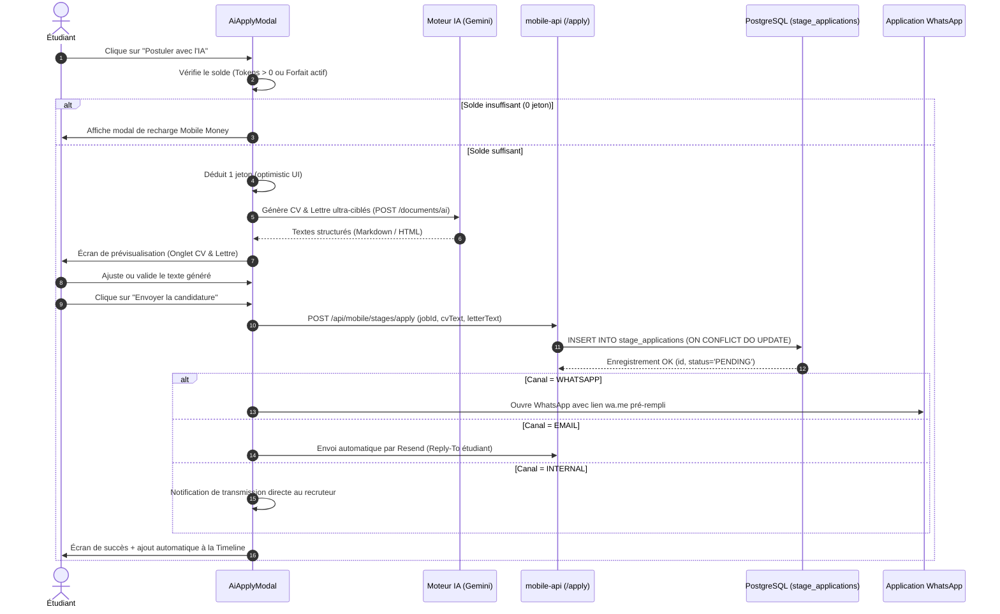
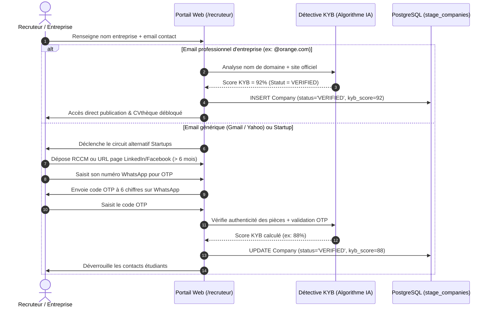

# Spécifications Fonctionnelles & Analyse Métier : Campus 360

> **Document de Référence Fonctionnelle & Technique**  
> **Auteur** : Analyste Fonctionnel & Technique Senior  
> **Dernière mise à jour** : Septembre 2026  
> **Périmètre** : Cœur de Matching & Automatisation de Stages IA, Atelier de Rédaction, Portail Recruteur B2B Anti-fraude KYB, Hub Académique & Micro-paiements Mobile Money.

---

## 1. Acteurs & Matrice de Permissions

Le système structure les interactions autour de 5 profils d'utilisateurs distincts :

| Acteur / Rôle | Contexte d'accès | Droits & Permissions | Restrictions Impératives |
|---|---|---|---|
| **Visiteur Anonyme** | Mobile Expo / Landing Web | • Consulter l'écran d'onboarding<br>• Explorer la vitrine publique des offres (sans coordonnées recruteurs)<br>• Consulter le catalogue PDF public | • Aucune postulation possible<br>• Aucun accès à l'atelier de rédaction<br>• Visualisation limitée à la couverture/aperçu des PDF |
| **Étudiant Gratuit (Free)** | Mobile Expo (Authentifié) | • Profilage complet & calcul de matching (%) en direct<br>• **1 candidature IA offerte** (CV + Lettre sur-mesure)<br>• Suivi de candidature dans la Timeline<br>• Atelier : rédaction et aperçu avec filigrane<br>• Lecture en ligne de PDF achetés ou gratuits | • Aucun export PDF ou Word de l'atelier<br>• Aucune relance automatique IA supplémentaire hors jeton acheté<br>• Téléchargement hors-ligne désactivé |
| **Étudiant Abonné (Basique / Pro / Elite)** | Mobile Expo (Authentifié) | • Quotas mensuels de candidatures IA (5, 10 ou 20)<br>• Rédactions atelier incluses (3, 5 ou 10)<br>• Exports PDF haute fidélité sans filigrane (Pro & Elite)<br>• Export Word `.docx` débloqué (Elite)<br>• Mode Hors-ligne sécurisé sur l'application (Pro & Elite)<br>• Badge **"Profil Boosté"** en CVthèque recruteurs (Elite)<br>• Chat IA étendu (500 à 2 000 messages/mois) | • Quota mensuel non cumulable sur le mois suivant<br>• Rate limiting anti-scraping (100 req/min) |
| **Recruteur / Entreprise (Non vérifié, KYB < 80)** | Portail Web (`/recruteur`) | • Création du compte entreprise et profil<br>• Soumission des pièces justificatives KYB (RCCM, réseaux sociaux, OTP)<br>• Publication d'offres de stage en statut `PENDING_REVIEW`<br>• Consultation de la CVthèque en mode restreint | • **Boutons "Contacter sur WhatsApp" et coordonnées étudiants désactivés**<br>• Offres non diffusées sur le flux mobile public tant que le score KYB n'atteint pas 80% |
| **Recruteur / Entreprise (Vérifié, KYB ≥ 80)** | Portail Web (`/recruteur`) | • Publication instantanée d'offres visibles sur le flux mobile<br>• Sponsoring quotidien d'offres via Mobile Money (1 000 FCFA/jour)<br>• Accès complet aux coordonnées des étudiants et aux vidéos de pitch<br>• Réception des candidatures in-app et changement de statut (`ACCEPTED`, `INTERVIEW`, etc.) | • Interdiction de publier des offres sans description claire ou à caractère frauduleux (pénalité de score KYB immédiate) |
| **Administrateur Campus 360** | Dashboard Admin (`/admin`) | • Supervision globale des utilisateurs et entreprises<br>• Validation ou suspension manuelle des comptes entreprises<br>• Gestion du catalogue PDF (prix, analyse IA, publication)<br>• Suivi en temps réel des transactions Mobile Money et alertes de fraude | • Nécessite une adresse autorisée (`ADMIN_ALLOWED_EMAILS`) et session chiffrée |

---

## 2. Dictionnaire des Entités Métier

### 2.1 Entités Cœur de Stage & Matching

#### `Student` (Profil Étudiant)
- **Rôle** : Représente le profil académique et professionnel de l'étudiant.
- **Attributs Clés** :
  - `auth_id` : Identifiant unique Better Auth.
  - `full_name` : Nom et prénom de l'étudiant.
  - `phone_whatsapp` : Numéro au format international E.164 (ex: `+237690000000`).
  - `email` : Adresse e-mail vérifiée.
  - `education_level` : Niveau d'études (ex: `BTS 2ème année`, `Licence 3`, `Master 2`).
  - `major` : Filière / spécialité (ex: `Génie Logiciel`, `Comptabilité & Finance`).
  - `skills` : Tableau ordonné de compétences (ex: `["React Native", "TypeScript", "SQL"]`).
  - `portfolio_url` : Lien optionnel (GitHub, Behance, LinkedIn).
  - `tokens` : Solde de jetons de candidature IA (1 jeton = 1 postulation complète).
  - `is_premium` : Indicateur de profil souscrit à un abonnement payant.
  - `boost_ends_at` : Date d'expiration de la mise en avant en CVthèque.
- **Cycle de Vie** : `INITIAL_ONBOARDING` -> `PROFILE_COMPLETE` -> `ACTIVE_APPLICANT` -> `PLACED_INTERN`.

#### `Company` (Entreprise / Recruteur)
- **Rôle** : Entité juridique publiant des opportunités de stage.
- **Attributs Clés** :
  - `name` : Raison sociale.
  - `industry` : Secteur d'activité (ex: `Banque & FinTech`, `BTP`, `Télécoms`).
  - `address` : Localisation physique du siège ou de l'agence.
  - `contact_email` : E-mail de réception des candidatures.
  - `contact_whatsapp` : Numéro WhatsApp professionnel de l'équipe RH.
  - `kyb_score` : Score de confiance anti-fraude calculé par IA (0 à 100).
  - `status` : Énumération (`UNVERIFIED`, `VERIFIED`, `SUSPENDED`).
  - `is_premium` : Statut entreprise partenaire.
  - `logo_url` : Miniature hébergée sur Cloudinary ou Supabase Storage.
- **Cycle de Vie** : `UNVERIFIED` (création) -> `KYB_AUDITING` -> `VERIFIED` (score ≥ 80) ou `SUSPENDED` (anomalie détectée).

#### `Job` (Offre de Stage)
- **Rôle** : Annonce de stage interne ou collectée par scraping.
- **Attributs Clés** :
  - `company_id` : Référence vers l'entreprise émettrice.
  - `title` : Intitulé précis du poste.
  - `description` : Descriptif des missions (plafonné à 2 000 caractères).
  - `requirements` : Compétences requises utilisées par l'algorithme de match.
  - `apply_method` : Énumération (`WHATSAPP`, `EMAIL`, `PHYSICAL`).
  - `is_sponsored` : Booléen de mise en avant prioritaire dans le feed.
  - `source` : Origine de l'offre (`INTERNAL` via portail recruteur ou `SCRAPED` via script OCR).
  - `location` : Ville, quartier ou modalité hybride / télétravail.
  - `duration` : Durée du stage (ex: `3 mois`, `6 mois`).
  - `stipend` : Rémunération / indemnité de transport (ex: `Rémunéré (80 000 FCFA/mois)`).
  - `flyer_url` & `video_url` : Visuels de l'offre.
  - `created_at` & `expires_at` : Horodatage d'activation (expiration par défaut à J+30).
- **Cycle de Vie** : `DRAFT` -> `PUBLISHED_ACTIVE` -> `EXPIRED` (J+30) ou `CLOSED`.

#### `Application` (Candidature)
- **Rôle** : Dossier de postulation liant un étudiant à une offre de stage.
- **Attributs Clés** :
  - `student_id` & `job_id` : Clé composite d'unicité (interdiction de double postulation).
  - `status` : Énumération (`PENDING`, `REVIEWING`, `INTERVIEW`, `ACCEPTED`, `REJECTED`).
  - `applied_at` : Date et heure de transmission.
  - `cv_file_url` & `letter_file_url` : Fichiers PDF générés.
  - `generated_cv_text` & `generated_letter_text` : Contenu textuel rédigé par l'IA.
  - `last_reminded_at` : Date de la dernière relance effectuée.
  - `notes` : Remarques personnelles de l'étudiant.
- **Cycle de Vie** :
  ```text
  [PENDING] ────► [REVIEWING] ────► [INTERVIEW] ────► [ACCEPTED]
      │               │                 │
      └───────────────┴─────────────────┴─────────► [REJECTED]
  ```

---

### 2.2 Entités Atelier, Wallet & Ressources

- **`Document` & `Section`** : Document de travail de l'étudiant (CV, lettre de motivation, rapport de stage, mémoire académique). Découpé en sections ordonnées (`sort_order`) pour permettre la génération incrémentale par l'IA et l'édition granulaire.
- **`Wallet` & `Transaction`** : Compte de monnaie virtuelle (`Coins`) et de crédits IA. Toute transaction possède un statut strict (`pending`, `success`, `failed`) et un type traçable (`topup`, `purchase`, `stage_token`, `subscription`, `commission`).
- **`CampusPdf` & `PdfPack`** : Épreuves d'examens et annales académiques vendues à l'unité ou en bundles avec réduction, protégées par signature d'URL temporaire (15 minutes).

---

## 3. Détail des Parcours Utilisateurs Séquentiels (V1)

---

### Parcours 1 : Onboarding Obligatoire & Profilage Initial



#### Point d'entrée
Premier lancement de l'application ou connexion d'un compte sans profil étudiant complet.

#### Étapes Séquentielles
1. **Écran 1 (Établissement)** : Sélection dans la liste des universités et grandes écoles (Douala, Yaoundé, ENSP, IUT, UCAC, etc.) ou saisie libre.
2. **Écran 2 (Filière & Niveau)** : Choix de la discipline et du palier académique (BTS 1/2, Licence 1/2/3, Master 1/2).
3. **Écran 3 (Compétences)** : Sélection guidée de 3 compétences au minimum via un sélecteur de puces interactives.
4. **Écran 4 (WhatsApp & Contact)** : Saisie du numéro WhatsApp international avec préfixe automatique du pays.
5. **Confirmation & Récompense** : Le système crée l'enregistrement dans `stage_students`, alloue **1 jeton de candidature IA offert** et redirige vers l'accueil.

#### Règles de Validation
- Minimum 3 compétences sélectionnées.
- Numéro de téléphone conforme au regex international `^\+[1-9]\d{7,14}$`.
- Filière et niveau d'études obligatoires.

#### Cas Limites & Gestion des Erreurs
- **Numéro WhatsApp erroné ou incomplet** :
  - *Comportement UI* : Bordure rouge sur l'input et message d'erreur : *"Numéro WhatsApp invalide. Format attendu : +2376XXXXXXXX ou +225XXXXXXXX"*.
  - *Blocage* : Le bouton "Continuer" reste inactif tant que la regex n'est pas satisfaite.
- **Perte de connexion réseau pendant la validation** :
  - *Comportement UI* : Modal de réessai avec bouton *"Réessayer"* sans effacer les champs déjà remplis dans l'état local (`SecureStore` en cache transitoire).
- **Tentative de contourner l'onboarding en quittant l'application** :
  - *Garde-fou* : Au redémarrage, `AppShell.tsx` vérifie `studentProfile?.skills?.length`. Si vide, l'onboarding se relance automatiquement sans laisser l'étudiant naviguer dans les offres.

---

### Parcours 2 : Flux de Stages & Algorithme de Match Dynamique

#### Point d'entrée
Onglet principal **[Stages]** de la barre de navigation mobile.

#### Étapes Séquentielles
1. L'étudiant clique sur l'onglet `Stages`.
2. Le système appelle `GET /api/mobile/stages` avec les filtres sélectionnés (domaine, mot-clé, ville).
3. Le client compare les `requirements` de chaque offre avec les `skills` du profil de l'étudiant :
   $$\text{MatchScore} = \left( \frac{|\text{Skills Étudiant} \cap \text{Requirements Offre}|}{|\text{Requirements Offre}|} \right) \times 100$$
4. L'interface affiche la liste ordonnée :
   - **Priorité 1** : Offres sponsorisées (`is_sponsored = true`).
   - **Priorité 2** : Score de match décroissant.
   - **Priorité 3** : Date de publication récente.
5. Chaque carte affiche un badge coloré :
   - **Vert ($80-100\%$)** : *"Match Idéal — Postule maintenant !"*
   - **Bleu ($60-79\%$)** : *"Bon Match — L'IA adaptera ta lettre."*
   - **Gris ($<60\%$)** : *"Match Partiel — Compétences à acquérir."*

#### Cas Limites & Gestion des Erreurs
- **L'offre n'a pas de compétences listées (`requirements` vide)** :
  - *Fallback* : Le score de match se base sur la concordance sémantique entre la filière de l'étudiant et le titre de l'offre (score neutre par défaut de $70\%$).
- **Aucune offre ne correspond aux filtres appliqués** :
  - *Comportement UI* : Affichage du composant `EmptyState` avec bouton *"Réinitialiser les filtres"* ou *"Activer l'alerte sur ce secteur"*.
- **L'offre a expiré pendant la navigation de l'étudiant** :
  - *Comportement API* : Lors d'un clic sur l'offre, si `expires_at < now()`, renvoi d'un statut HTTP 404. L'application affiche un Toast d'avertissement : *"Cette offre vient de se clôturer."* et retire la carte du feed.

---

### Parcours 3 : Postulation IA 1-Clic & Multi-Canaux



#### Point d'entrée
Bouton *"Postuler avec l'IA"* sur une carte d'offre dans [`StagesScreen.tsx`](file:///F:/mes%20projets/campus%20360/src/ui/screens/StagesScreen.tsx).

#### Étapes Séquentielles
1. **Étape 1 : Contrôle des Quotas & Déduction**
   - Le système vérifie si l'étudiant a au moins 1 jeton de candidature (`tokens >= 1`) ou un abonnement actif avec quota disponible.
   - Si solde = 0, l'étudiant est immédiatement invité à recharger via Mobile Money (1 000 FCFA) sans perdre la sélection de son offre.
2. **Étape 2 : Génération Ciblée par l'IA (Gemini 2.0/3.7 Flash)**
   - L'IA analyse les prérequis de l'offre et l'historique académique de l'étudiant.
   - Elle produit un CV synthétique orienté vers le poste et une lettre de motivation percutante qui compense les compétences manquantes.
3. **Étape 3 : Modal d'Édition & Prévisualisation**
   - L'étudiant prévisualise le CV et la lettre dans deux onglets dédiés.
   - Possibilité d'activer le mode édition (`isEditing`) pour ajuster une formule ou corriger une date avant envoi.
4. **Étape 4 : Déclenchement du Canal de Contact**
   - **Si l'entreprise accepte WhatsApp (`apply_method = 'WHATSAPP'`)** :
     - Construction du lien URL encodé : `https://wa.me/<contact_whatsapp>?text=<message_candidature_encode>`.
     - Ouverture directe de l'application WhatsApp du téléphone (`Linking.openURL`).
   - **Si l'entreprise préfère l'e-mail (`apply_method = 'EMAIL'`)** :
     - Envoi en arrière-plan via le service Resend avec l'adresse de l'étudiant en `Reply-To`.
   - **Si l'entreprise est partenaire interne (`source = 'INTERNAL'`)** :
     - Transmission directe de la candidature sur le dashboard recruteur.
5. **Étape 5 : Enregistrement en Base & Timeline**
   - L'enregistrement est persisté dans `public.stage_applications` avec statut `PENDING`.
   - L'application est ajoutée instantanément à la Timeline des candidatures.

#### Cas Limites & Gestion des Erreurs
- **L'utilisateur clique deux fois rapidement sur "Envoyer" (Double-Tap)** :
  - *Protection* : L'état `submitting` désactive immédiatement le bouton dès le premier appui. La requête SQL utilise `ON CONFLICT (student_id, job_id) DO UPDATE` pour garantir l'idempotence stricte.
- **WhatsApp n'est pas installé sur l'appareil (ex: tablette Android, Web)** :
  - *Détection* : Appel préalable à `Linking.canOpenURL('whatsapp://...')`.
  - *Fallback* : Si faux, l'interface propose d'ouvrir la version web de WhatsApp (`https://web.whatsapp.com`) ou de copier le texte dans le presse-papier avec affichage du numéro du recruteur.
- **Panne ou timeout de l'API IA (> 10 secondes)** :
  - *Comportement UI* : Le loader affiche un message : *"L'IA prend plus de temps que prévu..."*. Si échec, le jeton **n'est pas débité** et un message d'erreur rassurant s'affiche : *"Génération momentanément indisponible. Ton jeton reste intact. Réessaie dans quelques instants."*

---

### Parcours 4 : Suivi de Candidature & Relances J+7 (Duolingo Style)

#### Point d'entrée
Onglet **[Candidatures]** ou raccourci depuis la carte d'action dynamique de l'accueil.

#### Étapes Séquentielles
1. L'étudiant consulte la liste chronologique de ses candidatures dans [`ApplicationsTimelineScreen.tsx`](file:///F:/mes%20projets/campus%20360/src/ui/screens/ApplicationsTimelineScreen.tsx).
2. Chaque carte présente un fil d'étapes : `Envoyée` -> `En cours d'examen` -> `Entretien fixé` -> `Réponse finale`.
3. Le système compare la date courante avec `applied_at` et `last_reminded_at` :
   - Si $\Delta t < 7\text{ jours}$ : Le bouton de relance affiche : *"Relance conseillée dans X jours"*.
   - Si $\Delta t \ge 7\text{ jours}$ : Le bouton devient actif et vert : *"Relancer l'entreprise (J+7)"*.
4. Au clic sur *"Relancer"* :
   - L'IA prépare un message de relance poli, court et professionnel rappelant l'intérêt du candidat.
   - Le message est transmis via le même canal initial (WhatsApp ou Email).
   - Le champ `last_reminded_at` est mis à jour à `now()`.
5. Si l'étudiant marque son offre comme `ACCEPTED` :
   - Déclenchement d'une animation festive de confettis sur tout l'écran.
   - Proposition d'ouvrir l'Atelier pour préparer la convention de stage et les premiers objectifs.

#### Cas Limites & Gestion des Erreurs
- **L'étudiant tente de relancer plusieurs fois le même jour** :
  - *Blocage* : Le bouton de relance repasse en état inactif grisé pour les 7 prochains jours avec message : *"Relance déjà envoyée aujourd'hui. Laisse le temps au recruteur d'étudier ton dossier."*
- **L'entreprise a supprimé l'offre entre-temps** :
  - *Gestion* : La candidature reste consultable dans la Timeline pour historique, mais le statut indique : *"Offre archivée par l'entreprise"*.

---

### Parcours 5 : Inscription Recruteur & Détective Anti-Fraude KYB



#### Point d'entrée
Portail Web Recruteur ([`recruiter-web/app/recruteur/page.tsx`](file:///F:/mes%20projets/campus%20360/recruiter-web/app/recruteur/page.tsx)).

#### Étapes Séquentielles
1. **Étape 1 : Saisie initiale**
   - Le recruteur renseigne le nom de sa structure, son secteur d'activité, sa ville et son adresse e-mail.
2. **Étape 2 : Détection automatique du circuit de confiance**
   - *Circuit Entreprise Reconnue* : Si l'e-mail provient d'un nom de domaine d'entreprise vérifiable (non-gratuit) et qu'un site web existe, le score de confiance initial est fixé à **≥ 85%**. Le compte est immédiatement `VERIFIED`.
   - *Circuit Startup & Micro-Entreprise* : Si l'e-mail est générique (`@gmail.com`, `@yahoo.fr`), le compte est créé avec un score initial de **0%** (`UNVERIFIED`).
3. **Étape 3 : Audit Alternatif Startups (Score > 80% requis)**
   - L'entreprise doit fournir au moins **2 preuves parmi les 3 suivantes** :
     1. Numéro officiel de registre du commerce (RCCM ou identifiant fiscal local).
     2. Lien vers une page professionnelle d'entreprise (LinkedIn ou Facebook) créée depuis plus de 6 mois et régulièrement alimentée.
     3. Validation du numéro WhatsApp de l'entreprise via l'envoi et la confirmation d'un code OTP à 6 chiffres.
4. **Étape 4 : Déblocage des privilèges**
   - Dès que le score KYB dépasse **80%**, les restrictions de la CVthèque tombent : les numéros WhatsApp et les liens de vidéo de présentation des étudiants deviennent cliquables.

#### Cas Limites & Gestion des Erreurs
- **L'entreprise a un score KYB < 80% et tente de cliquer sur "Contacter sur WhatsApp"** :
  - *Comportement UI* : Bouton grisé avec cadenas 🔒. Clic déclenchant une infobulle explicative : *"Accès sécurisé réservé aux recruteurs certifiés. Finalise la vérification KYB de ton entreprise pour contacter les étudiants directement."*
- **Tentative d'enregistrement avec un faux RCCM ou document frauduleux** :
  - *Sanction* : L'algorithme place le compte en quarantaine (`SUSPENDED`), alertant l'administrateur Campus 360 dans son dashboard de supervision.

---

### Parcours 6 : Atelier de Rédaction & Politique d'Export Sécurisée

#### Point d'entrée
Onglet **[Créer]** de la navigation mobile ou accès depuis un document en cours d'édition.

#### Étapes Séquentielles
1. L'étudiant sélectionne un modèle : *CV professionnel*, *Lettre de motivation*, *Rapport de stage académique*, *Mémoire de fin d'études*.
2. Le système crée le document dans `public.app_documents` avec les sections prédéfinies (`TEMPLATE_SECTIONS`) dans `public.app_document_sections`.
3. L'étudiant édite son contenu dans [`DocumentEditorScreen.tsx`](file:///F:/mes%20projets/campus%20360/src/features/documents/DocumentEditorScreen.tsx) :
   - Saisie dans l'éditeur WebView riche.
   - Utilisation du chat IA latéral pour enrichir, reformuler ou structurer des sections.
   - Personnalisation visuelle : polices éditoriales, couleurs d'accent, interligne.
4. L'étudiant clique sur *"Exporter"*.
5. Le serveur applique strictement la **matrice des droits d'export** :
   - **Compte Gratuit** : Export PDF interdit côté serveur (`HTTP 403`). Aperçu visuel seul avec filigrane répété *"CAMPUS 360 - APERÇU ÉTUDIANT"*.
   - **Pass Basique** : Export PDF autorisé avec mention de filigrane discret en bas de page. Export Word refusé.
   - **Pass Pro** : Export PDF haute définition propre sans aucun filigrane. Export Word refusé.
   - **Pass Elite** : Export PDF et export Word `.docx` intégralement débloqués sans filigrane.

#### Cas Limites & Gestion des Erreurs
- **L'étudiant tente de contourner l'interdiction d'export via un appel direct à l'API (`POST /api/mobile/documents/[id]/export/pdf`)** :
  - *Sécurité Côté Serveur* : [`mobile-api/lib/document-export-policy.ts`](file:///F:/mes%20projets/campus%20360/mobile-api/lib/document-export-policy.ts) vérifie l'abonnement en base PostgreSQL avant de lancer Puppeteer. Si le compte est gratuit, renvoi strict d'une erreur 403 : *"L'export PDF nécessite au minimum le Pass Basique."*
- **Document volumineux avec de multiples images (> 20 Mo)** :
  - *Optimisation* : Compression automatique des images via Cloudinary avant insertion dans le PDF final pour éviter les plantages mémoires lors du rendu Puppeteer.

---

### Parcours 7 : Recharge Portefeuille Mobile Money (MTN / Orange / MoMo)

#### Point d'entrée
Bouton *"Recharger le wallet"* présent sur l'Accueil, le Profil ou lors d'un solde insuffisant.

#### Étapes Séquentielles
1. L'étudiant ouvre le modal de recharge.
2. Saisie du montant en Francs CFA (minimum 500 FCFA, presets à 500, 1 000, 2 500 FCFA).
3. Sélection de l'opérateur (MTN MoMo, Orange Money, Moov ou Wave).
4. Saisie du numéro de téléphone payeur.
5. Clic sur *"Valider le paiement"* :
   - Appel à `POST /api/mobile/wallet/topup`.
   - L'API contacte la passerelle Mobile Money qui envoie un push USSD sur le smartphone de l'étudiant : *"Valider le paiement de X FCFA avec votre code PIN"*.
6. L'application mobile passe en mode écoute (polling sécurisé toutes les 2 secondes pendant 90 secondes max).
7. Dès confirmation de la passerelle ou réception du webhook :
   - PostgreSQL exécute une transaction atomique :
     ```sql
     BEGIN;
     SELECT balance_coins FROM app_wallets WHERE user_id = $1 FOR UPDATE;
     UPDATE app_wallets SET balance_coins = balance_coins + $2 WHERE user_id = $1;
     INSERT INTO app_wallet_transactions (user_id, amount_coins, type, status) VALUES ($1, $2, 'topup', 'success');
     COMMIT;
     ```
   - L'étudiant reçoit un Toast de confirmation et le solde affiché se met à jour immédiatement.

#### Cas Limites & Gestion des Erreurs
- **L'étudiant saisit un montant inférieur à 500 FCFA** :
  - *Blocage UI* : Message instantané *"Le montant minimum de recharge est de 500 FCFA"*. Le bouton reste inactif.
- **L'étudiant annule le prompt USSD ou n'a pas assez de fonds sur sa carte SIM** :
  - *Résultat Polling* : La transaction passe en `failed`. L'interface affiche : *"Le paiement a été refusé ou a expiré. Aucun montant n'a été débité de ton compte Mobile Money."*
- **Déconnexion réseau pendant le polling de validation** :
  - *Résilience* : Même si l'application est fermée, le webhook serveur traite le paiement asynchronement. Dès la prochaine ouverture de l'application, `syncStudentAccount()` synchronise le nouveau solde en base.

---

## 4. Règles de Gestion & Limites Système

### 4.1 Quotas & Forfaits

| Règle de Gestion | Valeur / Limite | Sanction / Réaction du Système |
|---|---|---|
| **Montant minimum de recharge** | 500 FCFA | Formulaire bloqué si montant < 500 |
| **Durée de vie d'une offre de stage** | 30 jours calendaires | Statut basculé automatiquement à `EXPIRED` à J+30 |
| **Délai minimum de relance recruteur** | 7 jours | Bouton de relance désactivé avec compte à rebours |
| **Taille de description d'une offre** | 2 000 caractères max | Compteur de caractères et validation Zod |
| **Durée de validité des URL signées PDF** | 15 minutes (900 secondes) | URL révoquée automatiquement par Supabase Storage |
| **Score KYB minimum pour contacts B2B** | 80 sur 100 | Boutons d'action WhatsApp masqués/verrouillés |
| **Nombre de compétences onboarding** | 3 compétences minimum | Tunnel d'onboarding non franchissable si < 3 |
| **Rate-limiting par adresse IP** | 100 requêtes / minute | Réponse HTTP 429 (`Too Many Requests`) |

---

### 4.2 Formats & Volumes Autorisés

- **Documents d'Atelier** :
  - Export PDF : Format A4, styles typographiques vectoriels haute définition.
  - Export Word : Format `.docx` conforme aux normes universitaires (titres hiérarchisés, marges 2,5 cm).
- **Images de Flyers de Recrutement** :
  - Extensions acceptées : `.jpg`, `.jpeg`, `.png`, `.webp`.
  - Poids maximal par image : 5 Mo.
- **Vidéos de Pitch Étudiants (CVthèque)** :
  - Durée maximale : 30 secondes.
  - Poids maximal : 25 Mo (optimisé pour bande passante 3G/4G).

---

## 5. Décisions & Arbitrages Métier Validés

1. **Priorité Absolue aux Stages sur le Hub Académique** :
   - *Décision* : Les stages constituent la fonctionnalité maîtresse. Le catalogue de PDF et annales d'examens est repositionné dans l'onglet secondaire `[Ressources]`, évitant la confusion avec une simple bibliothèque en ligne.
2. **Postulation Hybride (WhatsApp / Email / In-App)** :
   - *Décision* : Ne pas forcer toutes les entreprises à utiliser le portail web. En Afrique Francophone, plus de 70% des premiers contacts de recrutement s'effectuent via WhatsApp. L'application capitalise sur cette réalité avec le lien direct pré-rempli.
3. **Double Instance Better Auth avec Secret Partagé** :
   - *Décision* : `mobile-api` et `recruiter-web` partagent la même base PostgreSQL et le même `BETTER_AUTH_SECRET`, garantissant qu'une session générée côté mobile ou web est authentifiée de manière transparente sur les deux plateformes.
4. **Suppression Définitive du Glassmorphism** :
   - *Décision* : Abandon des effets de flou de verre et des ombres lourdes au profit du Design System `Stitch` éditorial (aplats d'encre sombre, papier vanille, terracotta sienna et vert émeraude), offrant une lisibilité optimale en plein soleil et d'excellentes performances sur les smartphones d'entrée de gamme.
5. **Verrouillage Strict des Débits par Transactions SQL** :
   - *Décision* : Utilisation systématique de clauses `FOR UPDATE` lors des débits de coins ou de jetons IA pour éliminer tout risque de double consommation consécutif à un double-clic ou une perte de réseau.
