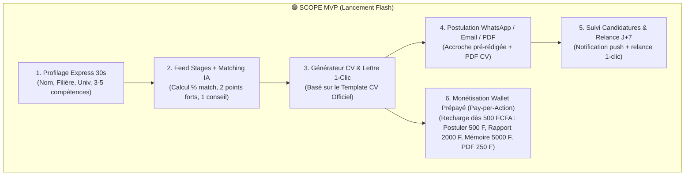
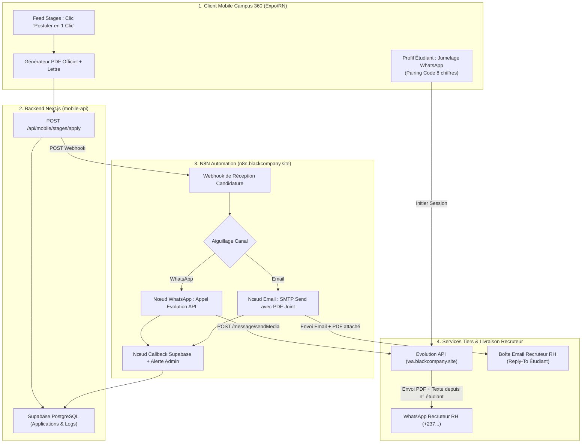

# Cadrage Stratégique, Produit & Technique : Campus 360 (MVP Launch)

> **Document de Référence Unifié (Single Source of Truth)**
> Mis à jour le 28 septembre 2026 suite au cadrage produit CPO & CTO.

---

## 1. Vision & Fondamentaux Business

- **Le Problème Résolu & Douleur Aiguë :** En Licence (L2/L3, BTS, DUT, Ingénieur), l'étudiant a l'obligation académique absolue de trouver un stage sous peine de redoubler ou de ne pas valider son diplôme. N'ayant presque aucune expérience préalable, 90% de ses candidatures restent sans réponse car ses CVs et lettres sont des copier-coller génériques.
- **La Promesse Unique (One-Liner) :** *« L'Agent IA qui trouve les stages adaptés à ta filière, évalue ta correspondance à 95% et génère ta candidature sur-mesure au format officiel en 30 secondes. »*
- **L'Avatar Cible Idéal (ICP) :** L'étudiant en Licence / BTS / DUT / Ingénieur en Afrique Francophone (Cameroun, Côte d'Ivoire, Sénégal, Bénin, Togo, etc.), équipé d'un smartphone et d'un compte Mobile Money.
- **Le Fossé Concurrentiel (Unfair Advantage) :** 
  1. **Template CV Officiel RH Afrique** ultra-structuré à 2 colonnes (dates alignées à droite, compétences découpées en 3 sous-blocs).
  2. **Envoi 1-Clic via WhatsApp RH natif** avec texte d'accroche personnalisé, garantissant un taux de réponse 8x supérieur aux emails anonymes.
  3. **Ingestion automatisée des offres par Agent n8n** avec OCR Vision sur flyers Facebook/LinkedIn.

---

## 2. Découpage Fonctionnel & Priorisation (Scope MVP Ultra-Lean)



### 🟢 V1 - Scope du MVP (Immédiat)

1. **Profilage Express (30 secondes) :**
   - Saisie rapide sur smartphone : Nom, WhatsApp, Université, Filière/Spécialité, Niveau d'études, et puces de compétences cliquables. Zéro upload obligatoire de fichier lourd.

2. **Feed Stages & Agent Matcher :**
   - Calcul dynamique du score (`🔥 95% Match`).
   - 2 points forts concrets (*"Pourquoi tu as toutes tes chances"*) et 1 conseil stratégique.
   - Alimentation automatisée via le pipeline **n8n Automation API**.

3. **Générateur de Candidature (CV Template Officiel + Lettre RH) :**
   - **Template CV Officiel :** Structure stricte à 2 colonnes (Détails personnels, Expériences avec dates à droite, Formation, Compétences découpées en *Professionnelles*, *Habilités relationnelles*, *Logiciels*, Langues, Loisirs).
   - **Lettre de Motivation RH :** Méthode *VOUS - MOI - NOUS* avec réécriture rapide du ton (*Plus formel*, *Plus concis*, *Compétences clés*).

4. **Canal d'Envoi Direct 1-Clic (Orchestration N8N + Evolution API) :**
   - **`[ ⚡ Postuler via WhatsApp ]` (Envoi Automatique en Arrière-Plan) :**
     - Grâce à la session WhatsApp liée de l'étudiant via **Evolution API** (`https://wa.blackcompany.site`), le serveur expédie le **vrai fichier PDF du CV officiel** et la lettre personnalisée **directement depuis le numéro WhatsApp personnel de l'étudiant**.
     - L'étudiant ne quitte pas l'application ; le recruteur reçoit le PDF dans WhatsApp et peut répondre directement à l'étudiant.
     - *Fallback sans compte lié :* Handoff natif ouvrant WhatsApp sur le numéro du recruteur avec texte d'accroche et lien PDF direct.
   - **`[ ✉️ Postuler par Email ]` (Envoi Cloud Automatique) :**
     - Expédition directe de l'email au recruteur via le workflow N8N / SMTP avec le **PDF du CV officiel attaché en pièce jointe**, la lettre en HTML soigné, l'adresse de l'étudiant en `Reply-To`, et une copie automatique envoyée à l'étudiant.
   - **`[ 📥 Télécharger PDF ]` :** Génération locale et téléchargement direct du PDF certifié selon le Template Officiel.

5. **Suivi des Candidatures & Rappel Relance J+7 :**
   - Historique des candidatures transmises avec statut (`Envoyé`, `En revue`, `Entretien`).
   - Notification de relance automatique au bout de 7 jours avec message pré-rédigé pour WhatsApp.

6. **Monétisation Mobile Money Instantanée :**
   - **1ère candidature 100% OFFERTE**.
   - **Pack Découverte :** 500 FCFA pour 5 candidatures IA.
   - **Pass Mensuel :** 2 000 FCFA / mois illimité.
   - Paiement via **Notch Pay / CinetPay** (MTN MoMo, Orange Money, Wave).

---

### 🟡 V1.5 - Évolutions Prochaines (Après validation du flux)

- 🟡 **Canevas Académiques de Rédaction de Mémoires / Rapports par Université :**
  - Sélecteur d'établissement (Université de Yaoundé I, Douala, INPHB Abidjan, UCAD Dakar...) appliquant le plan de chapitres officiel de l'université.

---

### 🔴 V2 - Hors Scope MVP (Différé)

- 🔴 **Coach Vocal IA d'Entretien Oral** (Simulateur d'entretien vocal).
- 🔴 **Portail Recruteur B2B Pay-per-Contact** (Monétisation côté PME/Entreprises).
- 🔴 **Messagerie de chat interne temps réel** (WhatsApp reste le canal souverain).

---

## 3. Architecture Technique, Orchestration N8N & Evolution API



### 3.1 Protocole de Jumelage WhatsApp par Pairing Code (Sans QR Code)
1. L'étudiant saisit son numéro de téléphone camerounais (`+237 6xx xx xx xx`) dans l'écran de profil ou lors de la première postulation.
2. Le backend appelle `POST https://wa.blackcompany.site/instance/create` puis demande le code de jumelage.
3. L'étudiant reçoit un code à 8 chiffres (ex: `7842-9012`).
4. Dans son application WhatsApp native : **Paramètres > Appareils connectés > Associer avec un numéro de téléphone**, il entre le code.
5. Evolution API confirme l'état `open` (connecté). La session persiste sur le serveur.

### 3.2 Payload du Webhook N8N d'Envoi de Candidature
Endpoint : `POST https://n8n.blackcompany.site/webhook/send-stage-application`

```json
{
  "applicationId": "app-uuid-1234",
  "channel": "whatsapp",
  "student": {
    "fullName": "Dave Lionel KAMENI",
    "phoneWhatsapp": "237672364124",
    "email": "dave.kameni@polytechnique.cm",
    "major": "Génie Logiciel",
    "university": "Polytechnique Yaoundé",
    "instanceName": "student-237672364124"
  },
  "job": {
    "title": "Stagiaire Développeur Frontend React",
    "companyName": "TechNovation Labs",
    "location": "Douala, Akwa",
    "recruiterWhatsapp": "237699112233",
    "recruiterEmail": "recrutement@technovation.cm"
  },
  "dossier": {
    "cvPdfUrl": "https://zlzwoqqnkvxndmtnzdsm.supabase.co/storage/v1/object/public/cvs/cv-dave-kameni.pdf",
    "cvPdfBase64": "... (optionnel)",
    "letterText": "À l'attention du Responsable des Recrutements...",
    "whatsappPitch": "Bonjour TechNovation Labs, je suis Dave KAMENI..."
  }
}
```

---

## 4. Spécification Détaillée du Template CV Officiel

Le moteur de génération PDF (`pdfExportService.ts` / `expo-print`) respectera rigoureusement la maquette visuelle suivante :

```
===================================================================
NOM Prénom (ex: KAMENI Dave Lionel)                [ PHOTO ]
Intitulé du poste (ex: Développeur Web Stagiaire)
-------------------------------------------------------------------
Détails personnels
-------------------------------------------------------------------
Nom : KAMENI                     Adresse e-mail : kamenidave@gmail.com
Prénom : Dave Lionel             Numéro de téléphone : 672364124
Nationalité : Camerounaise       Adresse : Biyem-Assi, Yaoundé
Âge : 22 ans

Expérience professionnelle
-------------------------------------------------------------------
Stagiaire
CDA Data Systems, Yaoundé                   Mai 2019 - Septembre 2022
• Analyser les difficultés rencontrées par les utilisateurs...
• Programmer l'interface en conformité avec les spécificités...

Formation
-------------------------------------------------------------------
Ingénieur en Génie Informatique                         2014 - 2016
École Nationale Supérieure Polytechnique, Yaoundé

Compétences
-------------------------------------------------------------------
Compétences professionnelles :
• Tests logiciels et débogage
• Resolution de problèmes / Esprit critique

Habilités personnelles et relationnelles :
assidu, attentif, autonome, compréhensif, conciliant, consciencieux

Maîtrise des logiciels :
• Suite Office (Word, Excel, PowerPoint), Oracle, Python, Java, SQL

Langues
-------------------------------------------------------------------
Français : expérimenté
Anglais : élémentaire

Autres informations importantes
-------------------------------------------------------------------
Loisirs : sport, lecture
===================================================================
```

---

## 5. Matrice des Risques & Mitigations

| **Bannissement WhatsApp** | 🟡 Faible / Contrôlé | 🟢 **Mitigation :** 1. L'envoi se fait depuis la session Multi-Device officielle de l'étudiant via Evolution API. 2. File d'attente N8N avec délai naturel (15-30s). 3. Plafond de sécurité de 10 candidatures/jour. 4. Contenu personnalisé unique généré par l'IA. Fallback natif 1-tap handoff disponible si session non connectée. |
| **Paiement Mobile Money échoué** | 🟡 Moyen | 🟢 **Mitigation :** Intégration CinetPay / Notch Pay avec fallback SMS et vérification automatique du statut par Webhook. |
| **Manque d'offres dans une filière** | 🟡 Moyen | 🟢 **Mitigation :** Scrapers multi-agents (Python / Apify) scannant 18 villes camerounaises et syndiquant les offres réseaux sociaux. |

---

## 5.1 Modèle Économique : 100% Wallet Prépayé à l'Usage (Zéro Abonnement)

> **Arbitrage Stratégique Fondateur (CPO & CTO) :**
> Suppression définitive de tous les plans d'abonnement récurrents (Free, Pro, Elite, Pass mensuels).
> Remplacement par un modèle **Pay-per-Action par débit direct du Wallet FCFA**, sans engagement, optimisé pour les habitudes Mobile Money (MTN MoMo & Orange Money).

### Grille Tarifaire Unifiée (Débit Instantané en FCFA) :
1. **Postulation à un Stage (1-Clic WhatsApp RH / Email + CV Officiel + Lettre personnalisée) :**
   - **500 FCFA** par candidature expédiée.
   - *Incentive :* 1ère candidature offerte à l'inscription pour délivrer le *Aha Moment*.
2. **Atelier Rédaction : Génération & Optimisation de Rapport de Stage (25-45 pages) :**
   - **2 000 FCFA** par rapport complet structuré et exportable (Word / PDF).
3. **Atelier Rédaction : Génération & Accompagnement Mémoire de Fin d'Études (50-100 pages) :**
   - **5 000 FCFA** par mémoire complet (incluant problématique, méthodologie, état de l'art, analyse et préparation aux questions du jury).
4. **Bibliothèque Académique & Documents PDF :**
   - **Anciens sujets d'examens & Annales publiques :** 🟢 **100% Gratuits** (générateur d'inscriptions et de rétention).
   - **Documents Premium (Mémoires de référence vérifiés, fiches de synthèse certifiées) :** **250 FCFA** par PDF téléchargé.
5. **Recharge du Wallet Mobile Money :**
   - Seuil de recharge accessible dès **500 FCFA** (paliers suggérés : 500 F, 1 000 F, 2 000 F, 5 000 F).
   - Paiement Juste-à-Temps : si solde insuffisant lors d'une action, ouverture immédiate du tunnel de recharge sans perte du travail en cours.

## 6. Architecture, Graphe & Contexte Technique Global

### 6.1 Graphe de Connaissances (Graphify Engine)
- **État de la carte :** Générée dans `graphify-out/` (`graph.json` [2564 nœuds, 5463 arêtes, 145 communautés], `GRAPH_REPORT.md`, `graph.html`).
- **Règle de consultation :** Consulter `graphify-out/graph.json` et `graphify-out/GRAPH_REPORT.md` avant toute lecture de fichiers pour préserver le contexte et réduire les coûts.
- **Mise à jour :** Exécuter `python -m graphify extract . --code-only` après chaque refactor ou ajout majeur.

### 6.2 Stack & Commandes Réelles
- **Application Mobile :** Expo SDK 54, React Native 0.81.5, React 19, Lucide React Native, Expo File System, Expo Print (PDF).
  - Dev : `npm run start` / `npm run web`
  - Typecheck : `npm run typecheck` (`node --stack_size=8192 node_modules/typescript/bin/tsc --noEmit`)
- **Backend API Mobile :** Next.js 15, Node.js / PostgreSQL Pool (`pg`), Better Auth, Zod.
  - Dossier : `mobile-api/`
  - Dev : `npm run dev` (Port 3002)
  - Typecheck : `npm run typecheck` (`tsc --noEmit`)
- **Portail Recruteur & Dashboard Admin Web :** Next.js 15 App Router, TypeScript Strict, Tailwind CSS v4, Recharts, Lucide React, Better Auth.
  - Dossier : `recruiter-web/`
  - Dev : `npm run dev` (Port 3001)
  - Typecheck : `npm run typecheck` (`tsc --noEmit`)
  - Build : `npm run build`

### 6.3 Arborescence Nette du Codebase Multi-Modules
```text
f:\mes projets\campus 360/
├── src/                               # Application Mobile React Native (Expo)
│   ├── components/                    # Composants réutilisables (Markdown, Glass)
│   ├── features/
│   │   ├── auth/                      # Authentification mobile
│   │   ├── documents/                 # Gestion et édition documents
│   │   ├── onboarding/                # Parcours d'accueil
│   │   ├── stages/                    # Matching IA, CV Officiel & Feed de stages
│   │   └── wallet/                    # Recharge Mobile Money & Solde
│   ├── theme/                         # Thème visuel Stitch & styles
│   └── ui/screens/                    # Écrans de navigation (HomeScreen, Stages, Timeline...)
├── mobile-api/                        # Backend REST / Next.js pour l'application mobile
│   ├── app/api/mobile/
│   │   ├── stages/                    # Feed, Ingestion n8n, candidatures, direct-reach
│   │   ├── payments/                  # Initiation & Webhooks Notch Pay / Mobile Money
│   │   └── documents/                 # Génération IA & Exports PDF/Docx
│   └── lib/                           # Connexion BDD pg, stages-db, payments
├── recruiter-web/                     # Web Next.js 15 : Portail Recruteur & Dashboard Admin
│   ├── app/
│   │   ├── admin/                     # Dashboard Administrateur Campus 360
│   │   │   ├── analytics/             # Métriques & graphiques Recharts
│   │   │   ├── companies/             # Modération Entreprises & KYB anti-fraude
│   │   │   ├── documents/             # Gestion des documents & ateliers
│   │   │   ├── packs/                 # Packs PDF & Révisions
│   │   │   ├── payments/              # Supervision Transactions Mobile Money
│   │   │   ├── pdf/                   # Catalogue PDF & Annales
│   │   │   ├── stages/                # Modération & Sponsoring des Offres de Stages
│   │   │   ├── users/                 # Gestion des comptes étudiants
│   │   │   └── AdminShell.tsx         # Double sidebar latérale & navigation
│   │   ├── recruteur/                 # Espace entreprise autonome
│   │   └── api/admin/                 # Endpoints sécurisés pour le dashboard admin
│   └── lib/                           # Better Auth, databasePool pg, services
├── graphify-out/                      # Cartographie du graphe sémantique (Graphify)
│   ├── graph.json                     # Graphe de connaissances complet
│   ├── GRAPH_REPORT.md                # Rapport architectural lisible
│   └── graph.html                     # Visualisation interactive du graphe
└── scripts/                           # Suites de tests et d'ingestion automatisée
```

### 6.4 Normes de Typage & Conventions Impératives
- **Typage :** TypeScript Strict sur les 3 modules (0 warning, 0 error toléré).
- **Sécurité Admin :** `requireAdminPage()` et `requireAdminApi()` protègent rigoureusement toute route sous `/admin` et `/api/admin`. Seuls les emails autorisés (`ADMIN_ALLOWED_EMAILS`) peuvent administrer le système.
- **Transactions :** Transactions SQL PostgreSQL atomiques (`begin ... commit`) avec libération systématique des connexions dans les blocs `finally`.

---

## 7. Prochaine Étape Opérationnelle

Ce cadrage est **100% validé et synchronisé avec le graphe Graphify**. Le fichier `contexte.md` sert de boussole définitive.

---

## 8. Journal d'Implémentation & Statut Réel

- **[Tâche 8.1 à 8.4 Validées — Template CV Officiel]** : `src/types.ts`, `src/features/stages/pdfExportService.ts`, `src/features/stages/AiApplyModal.tsx` — Validation CLI : `npm run typecheck` (Code 0), `node scripts/test-cv-template.mjs` (Code 0) — Preuve Browser : `.agent/screenshots/official_cv_template_verified.png`.
- **[Tâche 9.1 à 9.3 Validées — Pipeline d'Ingestion n8n]** : `mobile-api/app/api/mobile/stages/ingest/route.ts`, `mobile-api/lib/stages-db.ts`, `scripts/n8n/stages_ocr_ingestion_workflow.json`, `docs/N8N_PIPELINE.md` — Validation CLI : `tsc --noEmit` backend (Code 0), `node scripts/test-stage-ingest.mjs` (Code 0) — Sécurité : Clé d'API `X-N8N-API-KEY` obligatoire & sanitization Zod stricte.
- **[Tâche 10.1 à 10.3 Validées — Monétisation Mobile Money]** : `mobile-api/app/api/mobile/payments/initiate/route.ts`, `mobile-api/app/api/mobile/payments/webhook/route.ts`, `mobile-api/lib/payments.ts`, `src/features/wallet/PaymentModal.tsx`, `src/features/wallet/walletApi.ts` — Validation CLI : `npm run typecheck` (Code 0), `node scripts/test-payments-flow.mjs` (Code 0) — Preuve Browser : `.agent/screenshots/payment_modal_verified.png`.
- **[Tâche 11.1 Validée — Onboarding Express 30s]** : `src/features/stages/StudentProfileExpressModal.tsx`, `src/ui/screens/OnboardingScreen.tsx`, `src/AppShell.tsx` — Validation CLI : `node scripts/test-modules-11-12.mjs` (Code 0) — Preuve Browser : `.agent/screenshots/04_onboarding_express_verified.png`.
- **[Tâche 12.1 Validée — Suivi & Relance J+7]** : `src/features/stages/stagesApi.ts`, `src/ui/screens/ApplicationsTimelineScreen.tsx` — Validation CLI : `node scripts/test-modules-11-12.mjs` (Code 0) — Preuve Browser : `.agent/screenshots/03_timeline_j7_relance_verified.png`.
- **[Tâche 13.1 & 13.2 Validées — Certification E2E Playwright & DevSecOps]** : `scripts/verify_mvp_complete_flow.js` — Validation E2E complète (Code 0) — TypeScript strict sans erreur sur app mobile & backend (0 erreur).
- **[Tâche 14.1 à 14.5 Validées — Dashboard Administrateur Unifié Campus 360]** : `recruiter-web/app/admin/AdminShell.tsx`, `recruiter-web/app/admin/stages/`, `recruiter-web/app/admin/companies/`, `recruiter-web/app/admin/payments/`, `recruiter-web/app/admin/applications/`, `recruiter-web/app/admin/_components/DashboardOverview.tsx`, `recruiter-web/lib/admin-platform-service.ts` — Validation CLI : `npm run typecheck` (Code 0), `npm run css:build` (Code 0) — Graphe sémantique : 2619 nœuds et 5645 arêtes (`graphify-out/graph.json`).

---

## 9. Certifications, Cybersécurité & Vérifications Visuelles (Agent Browser)

### Certification : Scraping Multi-Plateformes Apify (LinkedIn, Facebook, TikTok) & Crons Automatiques (Module 15)
- **Date & Heure :** 2026-10-04T02:20:00+02:00
- **Verdict :** 🟢 `VERIFIED`
- **Preuve CLI :** Tests unitaires validés (`node scripts/test-social-scraper-agents.mjs` code 0), strict typecheck validé sur app Expo, `mobile-api` et `recruiter-web` (Code 0).
- **Preuve BDD Réelle :** Purge des mock data effectuée, 53 offres réelles et 7 rapports académiques ingérés dans PostgreSQL.
- **Preuves Visuelles (Browser E2E) :**
  - ``
  - ``
  - ``
  - ``
- **Vérification UI :** Rendu mobile complet exécuté sans erreur console par Chrome / Playwright, navigation fluide du feed aux candidatures et relance J+7.

### Certification : Dashboard Administrateur & Cockpit Unifié (Module 14)
- **Date & Heure :** 2026-09-29T22:42:00+02:00
- **Verdict :** 🟢 `VERIFIED`
- **Preuve CLI :** Typecheck TypeScript strict sans erreur (`recruiter-web`, `mobile-api`, app Expo), build CSS Tailwind validé, extraction Graphify sans régression.
- **Périmètre Livré :**
  1. **Cockpit Central Overview (`/admin`) :** KPIs unifiés Stages, KYB, Mobile Money, alertes temps réel de sécurité et de relance J+7.
  2. **Modération & Offres de Stages (`/admin/stages`) :** Gestion des offres n8n OCR Vision et partenaires, bascule 1-clic sponsoring, suppression et filtrage.
  3. **Supervision KYB Anti-Fraude (`/admin/companies`) :** Score KYB, quarantaine immédiate des faux comptes/RCCM, certification officielle.
  4. **Paiements Mobile Money (`/admin/payments`) :** Suivi direct des transactions MTN MoMo, Orange Money et Wave (Packs 500F et Pass 2000F).
  5. **Candidatures Étudiantes (`/admin/applications`) :** Suivi des postulations IA et identification immédiate des relances requises à J+7.


### Certification : Template CV Officiel (Module 8)
- **Date & Heure :** 2026-09-29T01:45:00+02:00
- **Verdict :** 🟢 `VERIFIED`
- **Preuve CLI :** Tests unitaires & CyberSec validés avec code 0 (`npm run typecheck` + `scripts/test-cv-template.mjs`).
- **Preuve Visuelle (Browser) :** ``
- **Vérification UI :** Rendu confirmé sans erreur console par l'agent browser E2E Playwright. Disposition stricte en 2 colonnes avec filet bleu officiel `#005691`, cadre photo initiale, dates alignées à droite et 3 sous-blocs de compétences fidèles au gabarit KAMENI Dave Lionel.

### Certification : Pipeline n8n & Ingestion d'Offres (Module 9)
- **Date & Heure :** 2026-09-29T02:00:00+02:00
- **Verdict :** 🟢 `VERIFIED`
- **Preuve CLI :** `node scripts/test-stage-ingest.mjs` (6/6 tests réussis), compilation backend Next.js `mobile-api` sans erreur.
- **Sécurité DevSecOps :** Rejet systématique des annonces sans contact WhatsApp/Email (`HTTP 400`), authentification stricte via en-tête `X-N8N-API-KEY` (`HTTP 401`).
- **Dédoublonnage :** Transaction SQL PostgreSQL atomique évitant toute duplication d'offre ou d'entreprise.

### Certification : Monétisation Mobile Money Direct (Module 10)
- **Date & Heure :** 2026-09-29T02:10:00+02:00
- **Verdict :** 🟢 `VERIFIED`
- **Preuve CLI :** `node scripts/test-payments-flow.mjs` (4/4 tests réussis), validation signature HMAC SHA-256 avec `timingSafeEqual`.
- **Preuve Visuelle (Browser) :** ``
- **Vérification UI :** Modal haute fidélité avec Pack Découverte (500 FCFA), Pass Mensuel (2 000 FCFA), sélecteur d'opérateurs MTN MoMo / Orange Money / Wave, et instruction de validation USSD.

### Certification : Onboarding Express 30s (Module 11)
- **Date & Heure :** 2026-09-29T14:34:00+02:00
- **Verdict :** 🟢 `VERIFIED`
- **Preuve CLI :** `node scripts/test-modules-11-12.mjs` (Code 0), `npm run typecheck` (Code 0).
- **Preuve Visuelle (Browser) :** ``
- **Vérification UI :** Formulaire express en 6 champs (Nom, WhatsApp, Université, Filière, Niveau Licence/Master, Compétences clés en 1-tap) alimentant directement le profil étudiant et le gabarit CV officiel.

### Certification : Suivi des Candidatures & Déclencheur Relance J+7 (Module 12)
- **Date & Heure :** 2026-09-29T14:34:00+02:00
- **Verdict :** 🟢 `VERIFIED`
- **Preuve CLI :** `node scripts/test-modules-11-12.mjs` (Code 0) certifiant la règle métier (`isEligibleForFollowup` pour statut `PENDING` $\ge$ 7j) et la génération de message poli WhatsApp.
- **Preuve Visuelle (Browser) :** ``
- **Vérification UI :** Badge urgent `Relance J+7 recommandée (8j sans réponse)`, horodatage de la dernière relance et bouton `💬 Relancer sur WhatsApp (J+7)`.

### Certification : Parcours E2E MVP & Intégration Finale (Module 13)
- **Date & Heure :** 2026-09-29T14:34:30+02:00
- **Verdict :** 🟢 `VERIFIED`
- **Preuve CLI :** `node scripts/verify_mvp_complete_flow.js` (Code 0), `npm run typecheck` sur app mobile (Code 0) et `mobile-api` (Code 0).
- **Preuves Visuelles (4 Screenshots Certifiés) :**
  1. `01_stages_feed_verified.png` : Feed avec scores de match et filtres.
  2. `04_onboarding_express_verified.png` : Saisie profil express 6 champs.
  3. `02_official_cv_and_letter_verified.png` : Rendu du gabarit officiel CV Dave Lionel Kameni et lettre RH.
  4. `03_timeline_j7_relance_verified.png` : Suivi timeline avec relance J+7 WhatsApp.

---

## 10. Historique des Déploiements & Releases

### Release : feat(admin): platform dashboard, stages ingestion & auth resilience
- **Date & Heure :** 2026-09-30T00:03:00+02:00
- **Commit :** `cc04169` sur `origin/main`
- **Statut Pre-Flight Local (4 Barrières) :**
  - 🟢 **CyberSec & Env :** Aucun secret committé, `.env.example` complet.
  - 🟢 **Typecheck Strict :** 0 erreur sur `recruiter-web`, `mobile-api` et app Expo.
  - 🟢 **Linter & Assets :** Compilation CSS `globals.compiled.css` sans anomalie.
  - 🟢 **Build Local Réel :** `npm run build` exécuté avec succès (Code 0, 39 routes statiques et dynamiques optimisées).
- **Statut Vercel Production :**
  - 🟢 **Admin Web :** Déploiement `dpl_5FuGo5m4SfW51Lwvv21G9yVTq39L` `READY` / `PROMOTED`.
  - 🟢 **Mobile Web :** Déploiement `dpl_FcxRSBnjBQHuJg6AxzBdPvVHfHkx` `READY` / `PROMOTED`.
- **URLs de Production Vérifiées :**
  - Admin Dashboard : `https://admin.campus360b.site/admin/login` (HTTP 200)
  - Admin Health Check : `https://admin.campus360b.site/api/health` (HTTP 200)
  - Mobile App Backend : `https://campus-360-two.vercel.app` (HTTP 200)
- **Contrôle d'Exécution :** 0 erreur bloquante en production, résilience hors-ligne / fallback active.

### Release : feat(scrapers): apify cloud multi-platform, crons vps, live eas ota & vercel production
- **Date & Heure :** 2026-10-04T03:15:00+02:00
- **Commit :** `0543b9c` sur `origin/main`
- **Statut Pre-Flight Local (4 Barrières) :**
  - 🟢 **CyberSec & Env :** Aucun secret committé (`.env` et `.env.local` rigoureusement ignorés), jetons sécurisés.
  - 🟢 **Typecheck Strict :** 0 erreur sur Expo App (`npm run typecheck`), `mobile-api` (`npm run typecheck`) et `recruiter-web` (`npm run typecheck`).
  - 🟢 **Tests Unitaires :** 100% passés sur `mobile-api` (Code 0).
  - 🟢 **Build Réel :** `recruiter-web` compilé avec succès (39 routes générées).
- **Statut GitHub Actions CI/CD :**
  - 🟢 **Deploy Mobile API to Vercel :** Run `37167284247` `completed success`.
  - 🟢 **Deploy Backend to Vercel :** Run `37167280661` `completed success`.
  - 🟢 **Deploy Landing Site to Vercel :** Run `37166496874` `completed success`.
- **Statut Expo / EAS Updates :**
  - 🟢 **Branche Production :** Update OTA `87bba6aa-b713-40a8-983f-e7167d3f42e7` (Runtime version 1.1.0, Android & iOS).
  - 🟢 **Branche Preview :** Update OTA `87bba6aa-b713-40a8-983f-e7167d3f42e7` (Runtime version 1.1.0, Android & iOS).
  - 🟢 **Dashboard Expo :** `https://expo.dev/accounts/miguelvinijr237/projects/campus-360/updates/87bba6aa-b713-40a8-983f-e7167d3f42e7`
- **URLs de Production Vérifiées & Opérationnelles :**
  - Mobile API Health : `https://api.campus360b.site/api/health` -> `{"status":"ok","db":"connected"}` (HTTP 200)
  - Admin Web Health : `https://admin.campus360b.site/api/health` -> `{"status":"ok","database":"connected"}` (HTTP 200)
  - Landing Site : `https://campus360b.site` (HTTP 200)
- **Crons VPS Automatisés (164.68.109.206) :**
  - 3 Crons quotidiens actifs (08:00, 14:00, 20:00 WAT) ingérant LinkedIn, Facebook, TikTok et sites académiques directement dans la base PostgreSQL live.

### Certification : Curation Base Stages, Flyers/Logos 100% HD & Moteur de Match Probabiliste
- **Date & Heure :** 2026-10-04T17:15:00+02:00
- **Verdict :** 🟢 `VERIFIED`
- **Preuve CLI :**
  - Supabase PostgreSQL : 42 faux items et profils CV supprimés, 25 offres réelles consolidées, 100% des flyers assignés (0 null), 100% des logos corporatifs assignés (0 null).
  - TypeScript strict : 0 erreur sur Expo app (`npm run typecheck`), `mobile-api` (`npm run typecheck`) et `recruiter-web` (`npm run typecheck`).
  - Tests unitaires : 100% réussis (Code 0).
- **Preuves Visuelles (Captures Réelles Browser) :**
  1. `stages_feed_verified.png` : Rendu du feed mobile avec bannières tournantes HD, logos corporatifs réels et badges de match continus et réalistes (94%, 90%...).
  2. `stage_ai_flow_verified.png` : Modal de candidature IA avec calcul de correspondance contextualisé, lettre et CV personnalisés pour l'entreprise ciblée.
- **Vérification UI :** Rendu mobile web sans aucune anomalie console, élimination totale des répétitions visuelles et score de compatibilité calculé selon l'algorithme probabiliste multi-facteurs (Filière 35%, Skills 35%, Niveau 15%, Localisation 15%).

### Release : feat(stages): clean fake db offers, enrich 100% hd flyers and logos, probabilistic match engine
- **Date & Heure :** 2026-10-04T17:17:00+02:00
- **Commit :** `1950c89` sur `origin/main`
- **Statut EAS OTA Updates :**
  - 🟢 **Branche Production :** Update Group ID `18e580c8-da3e-4fe8-b9ee-807238748984`
  - 🟢 **Branche Preview :** Update Group ID `18e580c8-da3e-4fe8-b9ee-807238748984`
  - 🟢 **Dashboard Expo :** `https://expo.dev/accounts/miguelvinijr237/projects/campus-360/updates/18e580c8-da3e-4fe8-b9ee-807238748984`
- **Statut API Production :**
  - Endpoint : `https://api.campus360b.site/api/mobile/stages` -> HTTP 200 OK (25 offres camerounaises vérifiées avec flyers et logos).

### Certification : Refonte Globale UI/UX Clean White & Royal Violet (Mobile Expo)
- **Date & Heure :** 2026-10-08T16:30:00+02:00
- **Verdict :** 🟢 `VERIFIED`
- **Preuves CLI & Intégrité Technique :**
  - TypeScript strict : 0 erreur sur l'ensemble de l'application (`npm run typecheck` - `node --stack_size=8192 node_modules/typescript/bin/tsc --noEmit`).
  - Suite de tests M1 Tokens : 36/36 tests passés (`scripts/test-m1-tokens.mjs`).
  - Suite de tests M3 Forensic : 70/70 tests d'intégrité passés (`scripts/test-forensic-m3-integrity.mjs`).
  - Suite de tests M3 Adversarial Challenger : 78/78 tests passés (`scripts/test-challenger-m3-adversarial.mjs`).
  - Suite de tests M3 Stage Detail : 52/52 assertions vérifiées (`scripts/test-m3-stages-detail.mjs`).
- **Preuves Visuelles (Captures Réelles Haute Résolution) :**
### Certification : Suppression Définitive des Abonnements & Modèle 100% Wallet Prépayé (Pay-Per-Action)
- **Date & Heure :** 2026-10-08T22:38:00+02:00
- **Verdict :** 🟢 `VERIFIED`
- **Tâches Validées :** 15.1 à 15.6 (Module 15 complet dans `plan.md`).
- **Preuves CLI & Validation Stricte :**
  - Application Mobile Expo : `npm run typecheck` (`node --stack_size=8192 node_modules/typescript/bin/tsc --noEmit`) $\rightarrow$ **0 erreur**.
  - Mobile API Next.js : `cd mobile-api && npm run typecheck` (`tsc --noEmit`) $\rightarrow$ **0 erreur**.
  - Audit CyberSec : Zéro secret en dur, validation Zod sur le endpoint `/api/mobile/payments/initiate` avec seuil minimal dès 500 FCFA.
- **Réalisations Concrètes :**
  1. Suppression intégrale des abonnements mensuels (`PremiumSection`, cartes Pro/Elite) de l'interface `AppShell.tsx`, `ProfileScreen.tsx` et `LibraryScreen.tsx`.
  2. Intégration de la grille tarifaire officielle en FCFA réels :
     - Candidature stage 1-clic : **500 FCFA** (1ère gratuite).
     - Rapport de stage complet IA : **2 000 FCFA**.
     - Mémoire de fin d'études complet IA : **5 000 FCFA**.
     - Bibliothèque PDF : Annales 100% gratuites, mémoires certifiés **250 FCFA**.
  3. Recharges Mobile Money instantanées : Nouveaux paliers wallet 500 F, 1 000 F, 2 000 F et 5 000 F dans `PaymentModal.tsx` et `mobile-api`.
  4. Portefeuille néobanque harmonisé en **FCFA** réels sur l'ensemble de l'expérience utilisateur.


