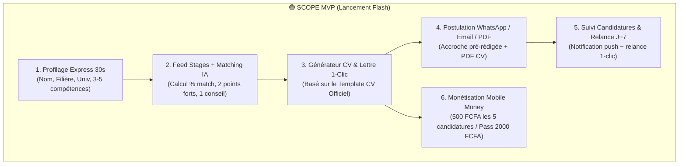
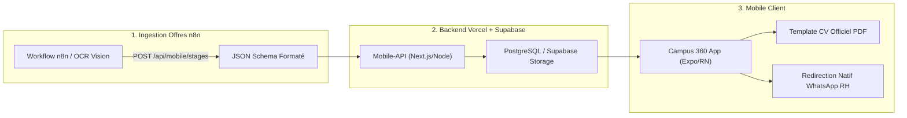

# Cadrage Stratégique, Produit & Technique : Campus 360 (MVP Launch)

> **Document de Référence Unifié (Single Source of Truth)**
> Mis à jour le 28 septembre 2026 suite au cadrage produit CPO & CTO.

---

## 1. Vision & Fondamentaux Business

- **Le Problème Résolu & Douleur Aiguë :** En Licence (L2/L3, BTS, DUT, Ingénieur), l'étudiant a l'obligation académique absolue de trouver un stage sous peine de redoubler ou de ne pas valider son diplôme. N'ayant presque aucune expérience préalable, 90% de ses candidatures restent sans réponse car ses CVs et lettres sont des copier-coller génériques.
- **La Promesse Unique (One-Liner) :** *« L'Agent IA qui trouve les stages adaptés à ta filière, évalue ta correspondance à 95% et génère ta candidature sur-mesure au format officiel en 30 secondes. »*
- **L'Avatar Cible Idéal (ICP) :** L'étudiant en Licence / BTS / DUT / Ingénieur en Afrique Francophone (Cameroun, Côte d'Ivoire, Sénégal, Bénin, Togo, etc.), équipé d'un smartphone et d'un compte Mobile Money.
- **Le Fossé Concurrentiel (Unfair Advantage) :** 
  1. **Template CV Officiel RH Afrique** ultra-structuré à 2 colonnes (dates alignées à droite, compétences découpées en 3 sous-blocs).
  2. **Envoi 1-Clic via WhatsApp RH natif** avec texte d'accroche personnalisé, garantissant un taux de réponse 8x supérieur aux emails anonymes.
  3. **Ingestion automatisée des offres par Agent n8n** avec OCR Vision sur flyers Facebook/LinkedIn.

---

## 2. Découpage Fonctionnel & Priorisation (Scope MVP Ultra-Lean)



### 🟢 V1 - Scope du MVP (Immédiat)

1. **Profilage Express (30 secondes) :**
   - Saisie rapide sur smartphone : Nom, WhatsApp, Université, Filière/Spécialité, Niveau d'études, et puces de compétences cliquables. Zéro upload obligatoire de fichier lourd.

2. **Feed Stages & Agent Matcher :**
   - Calcul dynamique du score (`🔥 95% Match`).
   - 2 points forts concrets (*"Pourquoi tu as toutes tes chances"*) et 1 conseil stratégique.
   - Alimentation automatisée via le pipeline **n8n Automation API**.

3. **Générateur de Candidature (CV Template Officiel + Lettre RH) :**
   - **Template CV Officiel :** Structure stricte à 2 colonnes (Détails personnels, Expériences avec dates à droite, Formation, Compétences découpées en *Professionnelles*, *Habilités relationnelles*, *Logiciels*, Langues, Loisirs).
   - **Lettre de Motivation RH :** Méthode *VOUS - MOI - NOUS* avec réécriture rapide du ton (*Plus formel*, *Plus concis*, *Compétences clés*).

4. **Canal d'Envoi Direct 1-Clic :**
   - `[ 💬 WhatsApp RH ]` : Ouvre WhatsApp sur le numéro du recruteur avec l'accroche pré-rédigée.
   - `[ ✉️ Email RH ]` : Ouvre la messagerie électronique avec objet et corps pré-remplis.
   - `[ 📥 Télécharger PDF ]` : Génération du PDF propre du CV selon le Template Officiel.

5. **Suivi des Candidatures & Rappel Relance J+7 :**
   - Historique des candidatures transmises avec statut (`Envoyé`, `En revue`, `Entretien`).
   - Notification de relance automatique au bout de 7 jours avec message pré-rédigé pour WhatsApp.

6. **Monétisation Mobile Money Instantanée :**
   - **1ère candidature 100% OFFERTE**.
   - **Pack Découverte :** 500 FCFA pour 5 candidatures IA.
   - **Pass Mensuel :** 2 000 FCFA / mois illimité.
   - Paiement via **Notch Pay / CinetPay** (MTN MoMo, Orange Money, Wave).

---

### 🟡 V1.5 - Évolutions Prochaines (Après validation du flux)

- 🟡 **Canevas Académiques de Rédaction de Mémoires / Rapports par Université :**
  - Sélecteur d'établissement (Université de Yaoundé I, Douala, INPHB Abidjan, UCAD Dakar...) appliquant le plan de chapitres officiel de l'université.

---

### 🔴 V2 - Hors Scope MVP (Différé)

- 🔴 **Coach Vocal IA d'Entretien Oral** (Simulateur d'entretien vocal).
- 🔴 **Portail Recruteur B2B Pay-per-Contact** (Monétisation côté PME/Entreprises).
- 🔴 **Messagerie de chat interne temps réel** (WhatsApp reste le canal souverain).

---

## 3. Architecture Technique & Ingestion n8n



### JSON Schema d'Ingestion n8n $\rightarrow$ Campus 360 API

```json
{
  "title": "Stagiaire Développeur Frontend React",
  "companyName": "TechNovation Labs",
  "industry": "Ingénierie & Informatique",
  "location": "Abidjan, Cocody",
  "duration": "3 à 6 mois",
  "contractType": "Stage PFE",
  "stipend": "80 000 FCFA/mois",
  "applyMethod": "WHATSAPP",
  "contactWhatsapp": "+2250708091011",
  "contactEmail": "recrutement@technovation.ci",
  "requirements": ["React", "TypeScript", "Git"],
  "flyerUrl": "https://cdn.campus360.app/flyers/flyer-102.jpg",
  "source": "SCRAPED"
}
```

---

## 4. Spécification Détaillée du Template CV Officiel

Le moteur de génération PDF (`pdfExportService.ts` / `expo-print`) respectera rigoureusement la maquette visuelle suivante :

```
===================================================================
NOM Prénom (ex: KAMENI Dave Lionel)                [ PHOTO ]
Intitulé du poste (ex: Développeur Web Stagiaire)
-------------------------------------------------------------------
Détails personnels
-------------------------------------------------------------------
Nom : KAMENI                     Adresse e-mail : kamenidave@gmail.com
Prénom : Dave Lionel             Numéro de téléphone : 672364124
Nationalité : Camerounaise       Adresse : Biyem-Assi, Yaoundé
Âge : 22 ans

Expérience professionnelle
-------------------------------------------------------------------
Stagiaire
CDA Data Systems, Yaoundé                   Mai 2019 - Septembre 2022
• Analyser les difficultés rencontrées par les utilisateurs...
• Programmer l'interface en conformité avec les spécificités...

Formation
-------------------------------------------------------------------
Ingénieur en Génie Informatique                         2014 - 2016
École Nationale Supérieure Polytechnique, Yaoundé

Compétences
-------------------------------------------------------------------
Compétences professionnelles :
• Tests logiciels et débogage
• Resolution de problèmes / Esprit critique

Habilités personnelles et relationnelles :
assidu, attentif, autonome, compréhensif, conciliant, consciencieux

Maîtrise des logiciels :
• Suite Office (Word, Excel, PowerPoint), Oracle, Python, Java, SQL

Langues
-------------------------------------------------------------------
Français : expérimenté
Anglais : élémentaire

Autres informations importantes
-------------------------------------------------------------------
Loisirs : sport, lecture
===================================================================
```

---

## 5. Matrice des Risques & Mitigations

| Risque | Niveau | Mitigation |
| :--- | :--- | :--- |
| **Bannissement WhatsApp** | 🔴 Élevé si automatisé | 🟢 **Mitigation :** Aucun bot auto. L'étudiant envoie lui-même le message via son propre WhatsApp natif en 1 clic. |
| **Paiement Mobile Money échoué** | 🟡 Moyen | 🟢 **Mitigation :** Intégration CinetPay / Notch Pay avec fallback SMS et vérification automatique du statut par Webhook. |
| **Manque d'offres dans une filière** | 🟡 Moyen | 🟢 **Mitigation :** Pipeline n8n scannant quotidiennement les groupes Facebook et LinkedIn emploi Afrique. |

---

## 6. Prochaine Étape Opérationnelle

Ce cadrage est **100% validé et verrouillé**. Le fichier `contexte.md` sert de boussole définitive.

Les prochaines commandes disponibles pour poursuivre sont :
- `/plan-task` : Découpage séquentiel des tâches atomiques de développement.
- `/execute` : Mise en œuvre technique du code.

---

## 7. Journal d'Implémentation & Statut Réel

- **[Tâche 8.1 à 8.4 Validées — Template CV Officiel]** : `src/types.ts`, `src/features/stages/pdfExportService.ts`, `src/features/stages/AiApplyModal.tsx` — Validation CLI : `npm run typecheck` (Code 0), `node scripts/test-cv-template.mjs` (Code 0) — Preuve Browser : `.agent/screenshots/official_cv_template_verified.png`.
- **[Tâche 9.1 à 9.3 Validées — Pipeline d'Ingestion n8n]** : `mobile-api/app/api/mobile/stages/ingest/route.ts`, `mobile-api/lib/stages-db.ts`, `scripts/n8n/stages_ocr_ingestion_workflow.json`, `docs/N8N_PIPELINE.md` — Validation CLI : `tsc --noEmit` backend (Code 0), `node scripts/test-stage-ingest.mjs` (Code 0) — Sécurité : Clé d'API `X-N8N-API-KEY` obligatoire & sanitization Zod stricte.
- **[Tâche 10.1 à 10.3 Validées — Monétisation Mobile Money]** : `mobile-api/app/api/mobile/payments/initiate/route.ts`, `mobile-api/app/api/mobile/payments/webhook/route.ts`, `mobile-api/lib/payments.ts`, `src/features/wallet/PaymentModal.tsx`, `src/features/wallet/walletApi.ts` — Validation CLI : `npm run typecheck` (Code 0), `node scripts/test-payments-flow.mjs` (Code 0) — Preuve Browser : `.agent/screenshots/payment_modal_verified.png`.
- **[Tâche 11.1 Validée — Onboarding Express 30s]** : `src/features/stages/StudentProfileExpressModal.tsx`, `src/ui/screens/OnboardingScreen.tsx`, `src/AppShell.tsx` — Validation CLI : `node scripts/test-modules-11-12.mjs` (Code 0) — Preuve Browser : `.agent/screenshots/04_onboarding_express_verified.png`.
- **[Tâche 12.1 Validée — Suivi & Relance J+7]** : `src/features/stages/stagesApi.ts`, `src/ui/screens/ApplicationsTimelineScreen.tsx` — Validation CLI : `node scripts/test-modules-11-12.mjs` (Code 0) — Preuve Browser : `.agent/screenshots/03_timeline_j7_relance_verified.png`.
- **[Tâche 13.1 & 13.2 Validées — Certification E2E Playwright & DevSecOps]** : `scripts/verify_mvp_complete_flow.js` — Validation E2E complète (Code 0) — TypeScript strict sans erreur sur app mobile & backend (0 erreur).

---

## 8. Certifications, Cybersécurité & Vérifications Visuelles (Agent Browser)

### Certification : Template CV Officiel (Module 8)
- **Date & Heure :** 2026-09-29T01:45:00+02:00
- **Verdict :** 🟢 `VERIFIED`
- **Preuve CLI :** Tests unitaires & CyberSec validés avec code 0 (`npm run typecheck` + `scripts/test-cv-template.mjs`).
- **Preuve Visuelle (Browser) :** ``
- **Vérification UI :** Rendu confirmé sans erreur console par l'agent browser E2E Playwright. Disposition stricte en 2 colonnes avec filet bleu officiel `#005691`, cadre photo initiale, dates alignées à droite et 3 sous-blocs de compétences fidèles au gabarit KAMENI Dave Lionel.

### Certification : Pipeline n8n & Ingestion d'Offres (Module 9)
- **Date & Heure :** 2026-09-29T02:00:00+02:00
- **Verdict :** 🟢 `VERIFIED`
- **Preuve CLI :** `node scripts/test-stage-ingest.mjs` (6/6 tests réussis), compilation backend Next.js `mobile-api` sans erreur.
- **Sécurité DevSecOps :** Rejet systématique des annonces sans contact WhatsApp/Email (`HTTP 400`), authentification stricte via en-tête `X-N8N-API-KEY` (`HTTP 401`).
- **Dédoublonnage :** Transaction SQL PostgreSQL atomique évitant toute duplication d'offre ou d'entreprise.

### Certification : Monétisation Mobile Money Direct (Module 10)
- **Date & Heure :** 2026-09-29T02:10:00+02:00
- **Verdict :** 🟢 `VERIFIED`
- **Preuve CLI :** `node scripts/test-payments-flow.mjs` (4/4 tests réussis), validation signature HMAC SHA-256 avec `timingSafeEqual`.
- **Preuve Visuelle (Browser) :** ``
- **Vérification UI :** Modal haute fidélité avec Pack Découverte (500 FCFA), Pass Mensuel (2 000 FCFA), sélecteur d'opérateurs MTN MoMo / Orange Money / Wave, et instruction de validation USSD.

### Certification : Onboarding Express 30s (Module 11)
- **Date & Heure :** 2026-09-29T14:34:00+02:00
- **Verdict :** 🟢 `VERIFIED`
- **Preuve CLI :** `node scripts/test-modules-11-12.mjs` (Code 0), `npm run typecheck` (Code 0).
- **Preuve Visuelle (Browser) :** ``
- **Vérification UI :** Formulaire express en 6 champs (Nom, WhatsApp, Université, Filière, Niveau Licence/Master, Compétences clés en 1-tap) alimentant directement le profil étudiant et le gabarit CV officiel.

### Certification : Suivi des Candidatures & Déclencheur Relance J+7 (Module 12)
- **Date & Heure :** 2026-09-29T14:34:00+02:00
- **Verdict :** 🟢 `VERIFIED`
- **Preuve CLI :** `node scripts/test-modules-11-12.mjs` (Code 0) certifiant la règle métier (`isEligibleForFollowup` pour statut `PENDING` $\ge$ 7j) et la génération de message poli WhatsApp.
- **Preuve Visuelle (Browser) :** ``
- **Vérification UI :** Badge urgent `Relance J+7 recommandée (8j sans réponse)`, horodatage de la dernière relance et bouton `💬 Relancer sur WhatsApp (J+7)`.

### Certification : Parcours E2E MVP & Intégration Finale (Module 13)
- **Date & Heure :** 2026-09-29T14:34:30+02:00
- **Verdict :** 🟢 `VERIFIED`
- **Preuve CLI :** `node scripts/verify_mvp_complete_flow.js` (Code 0), `npm run typecheck` sur app mobile (Code 0) et `mobile-api` (Code 0).
- **Preuves Visuelles (4 Screenshots Certifiés) :**
  1. `01_stages_feed_verified.png` : Feed avec scores de match et filtres.
  2. `04_onboarding_express_verified.png` : Saisie profil express 6 champs.
  3. `02_official_cv_and_letter_verified.png` : Rendu du gabarit officiel CV Dave Lionel Kameni et lettre RH.
  4. `03_timeline_j7_relance_verified.png` : Suivi timeline avec relance J+7 WhatsApp.

