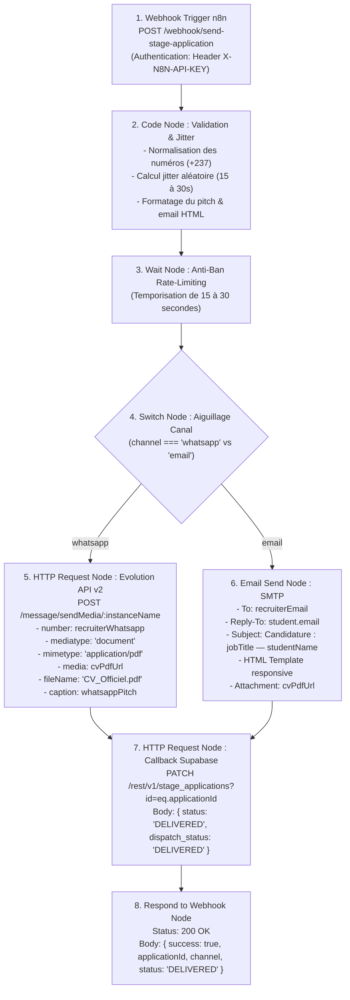

# Pipeline d'Expédition Automatisée des Candidatures (n8n $\rightarrow$ WhatsApp Evolution API & Email SMTP)

Ce document décrit l'architecture, la configuration, le protocole de routage et le déploiement du workflow n8n d'expédition automatisée en 1 clic des candidatures de stage pour **Campus 360**.

---

## 🏗️ Architecture du Pipeline

Le workflow orchestre la réception de la candidature depuis l'API backend (`mobile-api`), applique une temporisation anti-ban aléatoire (jitter), aiguille le message selon le canal sélectionné par l'étudiant (**WhatsApp** ou **Email**), notifie le recruteur avec le CV officiel en pièce jointe, et valide la réception en mettant à jour la table PostgreSQL Supabase en statut `DELIVERED`.



---

## 🔐 1. Spécification de l'Endpoint Webhook n8n

- **URL de Production :** `https://n8n.blackcompany.site/webhook/send-stage-application`
- **URL de Test n8n :** `https://n8n.blackcompany.site/webhook-test/send-stage-application`
- **Méthode HTTP :** `POST`
- **En-têtes obligatoires :**
  ```http
  Content-Type: application/json
  X-N8N-API-KEY: <N8N_API_KEY>
  ```

### Schéma du Payload JSON Entrant

```json
{
  "applicationId": "9b1deb4d-3b7d-4bad-9bdd-2b0d7b3dcb6d",
  "channel": "whatsapp",
  "student": {
    "fullName": "Dave Lionel KAMENI",
    "phoneWhatsapp": "237672364124",
    "email": "dave.kameni@polytechnique.cm",
    "major": "Génie Logiciel & Systèmes d'Information",
    "university": "École Nationale Supérieure Polytechnique de Yaoundé",
    "instanceName": "student-237672364124"
  },
  "job": {
    "title": "Stagiaire Développeur Mobile React Native",
    "companyName": "TechNovation Labs",
    "location": "Douala, Akwa",
    "recruiterWhatsapp": "237699112233",
    "recruiterEmail": "recrutement@technovation.cm"
  },
  "dossier": {
    "cvPdfUrl": "https://zlzwoqqnkvxndmtnzdsm.supabase.co/storage/v1/object/public/cvs/cv-dave-kameni-2026.pdf",
    "letterText": "Madame, Monsieur,\n\nÉtudiant passionné par l'écosystème React Native et TypeScript, je vous propose ma candidature pour votre stage de 3 à 6 mois. J'ai déjà conçu plusieurs applications mobiles performantes...",
    "whatsappPitch": "📢 *Nouvelle Candidature — Campus 360*\n\nBonjour *TechNovation Labs*,\n\nJe suis *Dave Lionel KAMENI*, étudiant en *Génie Logiciel* (Polytechnique Yaoundé).\n\nJ'ai le plaisir de postuler à votre offre : *Stagiaire Développeur Mobile React Native* à Douala, Akwa.\n\n📄 Mon CV officiel 2 colonnes est joint ci-dessus.\n\n📞 WhatsApp : https://wa.me/237672364124\n✉️ Email : dave.kameni@polytechnique.cm"
  }
}
```

### Description des Champs

| Champ | Type | Obligatoire | Description |
|---|---|---|---|
| `applicationId` | `string` (UUID) | Oui | Identifiant unique du dossier dans `public.stage_applications`. |
| `channel` | `string` (`"whatsapp"` \| `"email"`) | Oui | Canal de transmission choisi par l'étudiant. |
| `student.fullName` | `string` | Oui | Nom et prénom complets de l'étudiant. |
| `student.phoneWhatsapp` | `string` | Oui | Numéro WhatsApp normalisé (sans `+`, ex: `237672364124`). |
| `student.email` | `string` | Oui | Adresse courriel pour l'en-tête `Reply-To`. |
| `student.major` | `string` | Optionnel | Filière / spécialité académique. |
| `student.university` | `string` | Optionnel | Établissement universitaire de l'étudiant. |
| `student.instanceName` | `string` | Optionnel | Nom de session Evolution API (par défaut `student-<phone>`). |
| `job.title` | `string` | Oui | Intitulé exact du stage. |
| `job.companyName` | `string` | Oui | Nom de l'entreprise qui recrute. |
| `job.location` | `string` | Optionnel | Ville / quartier de l'entreprise. |
| `job.recruiterWhatsapp` | `string` | Requis si `channel === 'whatsapp'` | Numéro WhatsApp de l'entreprise ou du RH. |
| `job.recruiterEmail` | `string` | Requis si `channel === 'email'` | Adresse courriel du recruteur. |
| `dossier.cvPdfUrl` | `string` (URL HTTPS) | Oui | Lien public accessible du PDF officiel stocké sur Supabase Storage. |
| `dossier.letterText` | `string` | Optionnel | Texte de motivation rédigé ou généré par l'IA. |
| `dossier.whatsappPitch` | `string` | Optionnel | Texte formaté WhatsApp avec mise en gras et émojis. |

### Réponse du Webhook (HTTP 200 OK)

```json
{
  "success": true,
  "message": "Candidature expédiée avec succès au recruteur",
  "applicationId": "9b1deb4d-3b7d-4bad-9bdd-2b0d7b3dcb6d",
  "channel": "whatsapp",
  "status": "DELIVERED",
  "recruiterTarget": "237699112233",
  "deliveredAt": "2026-10-05T20:25:00.000Z"
}
```

---

## 🛡️ 2. Stratégie Anti-Ban & Rate-Limiting Jitter

WhatsApp applique des algorithmes heuristiques rigoureux pour détecter les envois automatisés non humains. Le workflow intègre 3 paliers de protection :

1. **Jitter Aléatoire Dynamique (15 à 30 secondes) :**
   - Le nœud de code calcule une temporisation aléatoire :
     ```javascript
     const jitterSeconds = Math.floor(Math.random() * 16) + 15; // 15..30 secondes
     ```
   - Le nœud `Temporisation Anti-Ban` (`n8n-nodes-base.wait`) retarde l'exécution du dispatch d'exactement `jitterSeconds`. Cela casse tout motif répétitif ou cadencé à intervalle fixe.
2. **Session Multi-Device Dédiée à l'Étudiant (`student-<phone>`) :**
   - L'envoi ne s'effectue **pas** depuis un numéro générique ou un bot de masse.
   - Il transite par la propre session de l'étudiant préalablement appairée via son code à 8 chiffres Evolution API (`POST /instance/connect/:instance`). Aux yeux de WhatsApp, le message provient du compte légitime de l'étudiant.
3. **Plafond Journalier de Sécurité :**
   - Le backend `mobile-api` limite les candidatures à un maximum raisonnable par jour et par compte étudiant (ex: 20 candidatures/jour).

---

## 📱 3. Branche WhatsApp — Evolution API v2

### A. Endpoint & En-têtes
- **URL :** `POST {{ $env.EVOLUTION_API_URL }}/message/sendMedia/{{ $json.student.instanceName }}`
- **En-têtes :**
  - `apikey: {{ $env.EVOLUTION_API_KEY }}`
  - `Content-Type: application/json`

### B. Payload Envoyé à Evolution API
```json
{
  "number": "237699112233",
  "mediatype": "document",
  "mimetype": "application/pdf",
  "media": "https://zlzwoqqnkvxndmtnzdsm.supabase.co/storage/v1/object/public/cvs/cv-dave-kameni-2026.pdf",
  "fileName": "CV_Officiel.pdf",
  "caption": "📢 *Nouvelle Candidature — Campus 360*\n\nBonjour *TechNovation Labs*..."
}
```

Evolution API télécharge automatiquement le document PDF depuis l'URL Supabase et l'expédie sous forme de document WhatsApp avec prévisualisation et texte d'accompagnement directement dans la conversation avec le recruteur.

---

## ✉️ 4. Branche Email — Nœud SMTP

Lorsque `channel === "email"`, le workflow active le nœud SMTP (`n8n-nodes-base.emailSend`) avec les caractéristiques suivantes :

- **Expéditeur (`From`) :** `candidatures@campus360.app`
- **Destinataire (`To`) :** `{{ $json.job.recruiterEmail }}`
- **Réponse à (`Reply-To`) :** `{{ $json.student.email }}` (le recruteur répond directement à l'étudiant sans intermédiaire).
- **Objet :** `Candidature Stage : [Intitulé du Poste] — [Nom de l'Étudiant]`
- **Corps :** Template HTML professionnel responsive aux couleurs de Campus 360 (badge, récapitulatif du candidat, lettre de motivation et bouton de consultation directe).
- **Pièce jointe :** Téléchargement et attachement direct du fichier PDF via son URL `cvPdfUrl`.

---

## 🗄️ 5. Callback Supabase (Mise à Jour de Statut)

Après expédition réussie par WhatsApp ou Email, le workflow appelle l'API REST PostgREST de Supabase :

- **Méthode :** `PATCH`
- **URL :** `{{ $env.SUPABASE_URL }}/rest/v1/stage_applications?id=eq.{{ $json.applicationId }}`
- **En-têtes :**
  - `apikey: {{ $env.SUPABASE_SERVICE_ROLE_KEY }}`
  - `Authorization: Bearer {{ $env.SUPABASE_SERVICE_ROLE_KEY }}`
  - `Content-Type: application/json`
  - `Prefer: return=representation`
- **Body :**
  ```json
  {
    "status": "DELIVERED",
    "dispatch_status": "DELIVERED",
    "delivered_at": "2026-10-05T20:25:00.000Z"
  }
  ```

---

## 📦 6. Déploiement et Importation dans n8n

### Étape 1 : Importer le Workflow
1. Connectez-vous à votre instance n8n (`https://n8n.blackcompany.site`).
2. Rendez-vous dans **Workflows** $\rightarrow$ **Add Workflow** $\rightarrow$ menu déroulant $\rightarrow$ **Import from File**.
3. Sélectionnez le fichier :
   [`scripts/n8n/send_stage_application_workflow.json`](file:///c:/Users/DELL/Desktop/mes%20projet/campus-360/scripts/n8n/send_stage_application_workflow.json).

### Étape 2 : Configurer les Variables d'Environnement
Dans l'environnement de votre conteneur n8n (fichier `.env` ou docker-compose), vérifiez la présence des variables suivantes :

```env
# Evolution API (WhatsApp)
EVOLUTION_API_URL=https://wa.blackcompany.site
EVOLUTION_API_KEY=evolution_key_douala_2026

# Supabase REST
SUPABASE_URL=https://zlzwoqqnkvxndmtnzdsm.supabase.co
SUPABASE_SERVICE_ROLE_KEY=eyJhbGciOiJIUzI1NiIsInR5cCI6IkpXVCJ9...

# Email SMTP
SMTP_HOST=smtp.mailgun.org
SMTP_PORT=587
SMTP_USER=postmaster@campus360.app
SMTP_PASS=secret_smtp_password
SMTP_FROM_EMAIL=candidatures@campus360.app
```

### Étape 3 : Configurer le Compte SMTP dans n8n
Dans l'interface n8n, créez ou liez un credential de type **SMTP** nommé `campus360-smtp-creds` avec les informations d'authentification ci-dessus.

### Étape 4 : Activer le Workflow
Basculez le sélecteur **Active** en haut à droite sur **Active**. Le webhook est désormais prêt à écouter les requêtes.

---

## 🧪 7. Commandes de Test Rapide (cURL)

### Test A : Expédition via WhatsApp (Evolution API)

```bash
curl -X POST https://n8n.blackcompany.site/webhook/send-stage-application \
  -H "Content-Type: application/json" \
  -H "X-N8N-API-KEY: campus360_n8n_secret_prod_key" \
  -d '{
    "applicationId": "test-app-wa-001",
    "channel": "whatsapp",
    "student": {
      "fullName": "Dave Lionel KAMENI",
      "phoneWhatsapp": "237672364124",
      "email": "dave.kameni@polytechnique.cm",
      "major": "Génie Logiciel",
      "university": "Polytechnique Yaoundé",
      "instanceName": "student-237672364124"
    },
    "job": {
      "title": "Stagiaire Développeur Frontend React",
      "companyName": "TechNovation Labs",
      "location": "Douala, Akwa",
      "recruiterWhatsapp": "237690123456",
      "recruiterEmail": "recrutement@technovation.cm"
    },
    "dossier": {
      "cvPdfUrl": "https://zlzwoqqnkvxndmtnzdsm.supabase.co/storage/v1/object/public/cvs/cv-sample.pdf",
      "letterText": "Bonjour, je souhaite postuler pour ce stage.",
      "whatsappPitch": "📢 *Nouvelle Candidature — Campus 360*\n\nBonjour *TechNovation Labs*, voici mon CV officiel."
    }
  }'
```

### Test B : Expédition via Email (SMTP)

```bash
curl -X POST https://n8n.blackcompany.site/webhook/send-stage-application \
  -H "Content-Type: application/json" \
  -H "X-N8N-API-KEY: campus360_n8n_secret_prod_key" \
  -d '{
    "applicationId": "test-app-email-002",
    "channel": "email",
    "student": {
      "fullName": "Dave Lionel KAMENI",
      "phoneWhatsapp": "237672364124",
      "email": "dave.kameni@polytechnique.cm",
      "major": "Génie Logiciel",
      "university": "Polytechnique Yaoundé"
    },
    "job": {
      "title": "Stagiaire Data Analyst",
      "companyName": "FinTech Africa",
      "location": "Yaoundé, Bastos",
      "recruiterWhatsapp": "237699001122",
      "recruiterEmail": "rh@fintech-africa.com"
    },
    "dossier": {
      "cvPdfUrl": "https://zlzwoqqnkvxndmtnzdsm.supabase.co/storage/v1/object/public/cvs/cv-sample.pdf",
      "letterText": "Madame, Monsieur, veuillez trouver ci-joint mon CV pour le poste de Data Analyst."
    }
  }'
```
