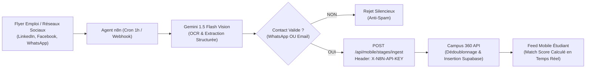

# Pipeline d'Ingestion Automatisée n8n $\rightarrow$ Campus 360 API

Ce document décrit le fonctionnement, la configuration et le déploiement du pipeline d'ingestion automatisée des offres de stages et d'emplois via l'agent **n8n**.

---

## 🏗️ Architecture du Pipeline



---

## 🔐 1. Spécification de l'Endpoint d'Ingestion

- **URL de Production :** `https://api.campus360b.site/api/mobile/stages/ingest`
- **URL Locale :** `http://localhost:3000/api/mobile/stages/ingest`
- **Méthode :** `POST`
- **En-têtes obligatoires :**
  ```http
  Content-Type: application/json
  X-N8N-API-KEY: <N8N_INGESTION_SECRET>
  ```

### Payload JSON Attendu :
```json
{
  "title": "Stagiaire Développeur Mobile Flutter",
  "companyName": "Digital Wave Africa",
  "industry": "Informatique & Télécoms",
  "location": "Abidjan, Cocody",
  "duration": "3 à 6 mois",
  "contractType": "Stage Académique",
  "stipend": "50 000 FCFA / mois",
  "requirements": ["Flutter", "Dart", "Git", "REST APIs"],
  "contactWhatsapp": "+2250701020304",
  "contactEmail": "recrutement@digitalwave.ci",
  "description": "Stage pratique de pré-embauche sur nos applications fintech.",
  "flyerUrl": "https://storage.campus360.app/flyers/wave_flutter_2026.png",
  "source": "SCRAPED",
  "expiresInDays": 30
}
```

### Réponses de l'API :
- **HTTP 201 Created :**
  ```json
  {
    "success": true,
    "jobId": "8f38bc42-1209-4d6f-87e2-cf29b19e4a31",
    "companyId": "c4921938-ff21-419b-a019-918239023812",
    "isNew": true,
    "message": "Nouvelle offre de stage ingérée avec succès."
  }
  ```
- **HTTP 401 Unauthorized :**
  ```json
  { "error": "Non autorisé : Clé API X-N8N-API-KEY invalide ou absente.", "success": false }
  ```
- **HTTP 400 Bad Request :**
  ```json
  { "error": "Au moins un moyen de contact valide (WhatsApp ou Email) est obligatoire pour publier l'offre." }
  ```

---

## 📦 2. Importation du Workflow dans n8n

1. Ouvrez votre instance n8n (ex: `https://n8n.campus360b.site`).
2. Allez dans le menu **Workflows** $\rightarrow$ **Import from File**.
3. Sélectionnez le fichier [`scripts/n8n/stages_ocr_ingestion_workflow.json`](file:///f:/mes%20projets/campus%20360/scripts/n8n/stages_ocr_ingestion_workflow.json).
4. Configurez les variables d'environnement suivantes dans n8n :
   - `N8N_INGESTION_SECRET` : Clé secrète partagée avec `mobile-api`.
   - `GEMINI_API_KEY` : Clé d'API Google AI Studio pour le nœud Vision.
5. Activez le workflow.

---

## 🧪 3. Commande de Test Rapide (Curl)

```bash
curl -X POST http://localhost:3000/api/mobile/stages/ingest \
  -H "Content-Type: application/json" \
  -H "X-N8N-API-KEY: campus360_n8n_secret_prod_key" \
  -d '{
    "title": "Stagiaire Développeur React Native",
    "companyName": "TechNovation Labs",
    "location": "Douala, Akwa",
    "contactWhatsapp": "+237690123456",
    "requirements": ["React Native", "TypeScript"]
  }'
```
